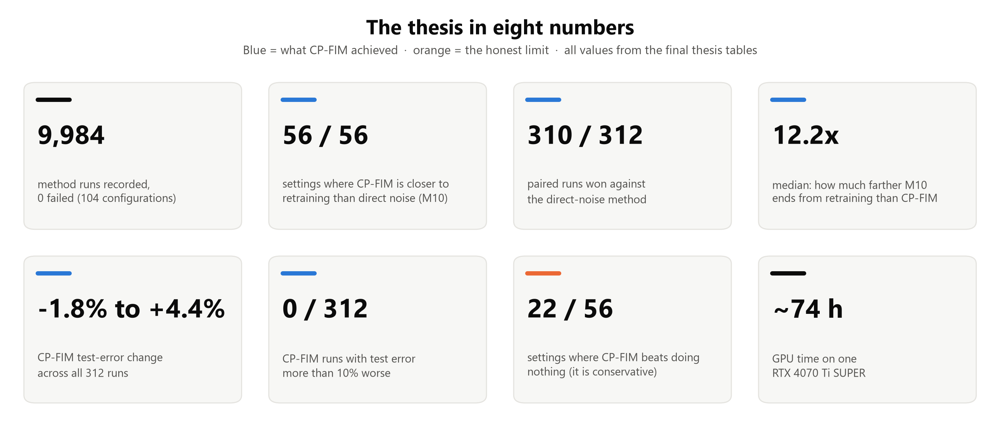
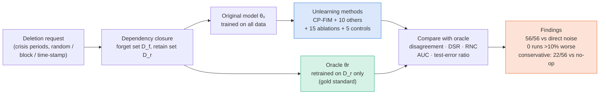
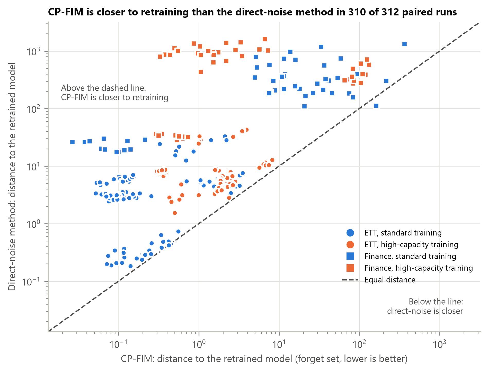
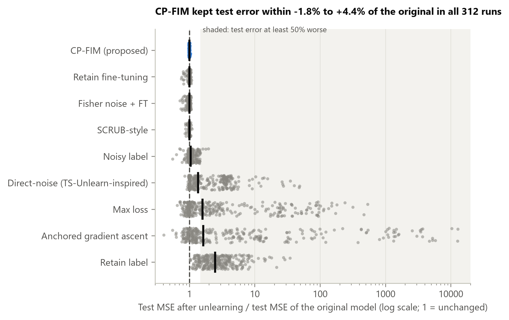
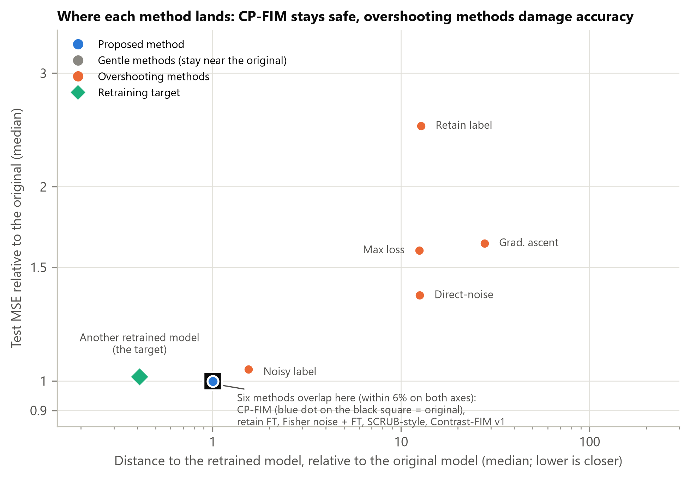
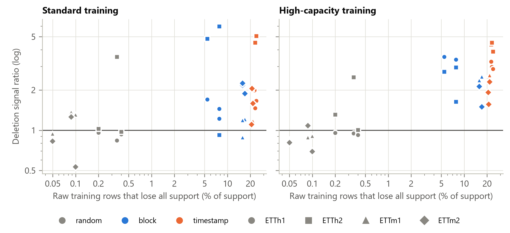

# Thesis Study Guide: Selective Unlearning for Temporal Regression

**Thesis title:** *Evaluating Selective Unlearning for Temporal Regression Models: CP-FIM and Retrain-Referenced Evidence on Financial and Energy Time Series*

**Authors:** Md. Tariquzzaman · Anirban Saha · Sharaf Binte Younus · Sadia Binte Kamal
**Supervisor:** Dr. Md. Golam Rabiul Alam, Professor, Department of CSE, Brac University
**Degree:** B.Sc. in Computer Science and Engineering, Brac University, October 2026

This repository explains the whole thesis with figures. You should be able to understand it, explain it and defend it without opening the 109-page PDF. Every number here was copied from the final thesis source (chapters, tables and figure captions). Where this guide names a table or figure, it uses the thesis numbering (for example "Table 5.6") so you can find it in the PDF.



---

## The thesis in 60 seconds

1. **The problem.** A trained model keeps traces of its training data. If someone asks for data to be deleted (GDPR "right to erasure"), or the data was wrong or unusual, the model has to *forget* it. Retraining from scratch without that data is the gold standard, but it is expensive. **Machine unlearning** tries to update the existing model cheaply instead.
2. **Why forecasting is harder.** Forecasting models learn from overlapping *sliding windows*. Two neighbouring windows can share about 98% of their values, so deleting one window does not delete the data inside it. What "delete" means has to be defined carefully.
3. **What we built.** **CP-FIM** (Contrast-Preconditioned Fisher Information Matrix unlearning): a teacher–student update that (a) scales changes by how much each parameter matters to the forget data versus the retain data, (b) uses the *teacher's own forecast plus small noise* as the forget target, and (c) balances forgetting and retaining with a safeguarded Pareto (MGDA) weight.
4. **How we tested it.** 8 datasets (4 financial, 4 ETT electricity), 5 model types (LSTM, GRU, BiLSTM, CNN-LSTM, PatchTST), 2 training regimes, 3 deletion styles, 12 methods + 15 ablations + 5 controls. In total: **104 configurations and 9,984 method runs, with 0 failures, in about 74 GPU-hours.** Every method was judged against a model **retrained** without the deleted data.
5. **Headline result.** CP-FIM is **closer to retraining than the TS-Unlearn-inspired direct-noise method in 56 of 56 settings (310 of 312 runs)**. The median gap is **12.2×**. CP-FIM is also closer than **all five aggressive methods in 56/56 settings**. Its test error stayed between **−1.8% and +4.4%** of the original in **every one of the 312 runs**.
6. **The honest limit (scope).** CP-FIM is *stable but conservative*. It beats "doing nothing" in only 22 of 56 settings, and retain-only fine-tuning in only 15. The financial price-level models lose to a simple "tomorrow = today" forecast, so **ETT is the main evidence**.
7. **What the evaluation itself found.** Random-window deletion (the protocol TS-Unlearn uses) removes almost no unique information. Block and time-stamp deletion remove much more. A loss-based membership test and prediction agreement can disagree. Unconstrained Pareto distillation **stalls at step 1**. We found this, explained it and fixed it.

---

## The whole thesis in one diagram



---

## How to study this repo

| # | Guide chapter | What you will learn | Thesis chapter | Time |
|---|---|---|---|---|
| 1 | [The big picture](docs/01_big_picture.md) | Unlearning, sliding windows, the three outcomes, research questions | Ch 1 | 20 min |
| 2 | [Background and literature](docs/02_background_and_literature.md) | Key concepts and the 44 cited works, grouped by idea | Ch 2 | 25 min |
| 3 | [Data and deletion requests](docs/03_data_and_deletion.md) | Datasets, leakage control, crisis periods, 3 ETT protocols, dependency closure | Ch 4.4 | 20 min |
| 4 | [Models and training regimes](docs/04_models_and_training.md) | LSTM / GRU / BiLSTM / CNN-LSTM / PatchTST, standard vs high-capacity, the grid | Ch 4.5, 4.8 | 15 min |
| 5 | [CP-FIM: the method](docs/05_cpfim_method.md) | All 5 steps, the equations, the algorithm, safeguards, why it is stable | Ch 4.1–4.3 | 40 min |
| 6 | [Comparison methods and ablations](docs/06_comparison_methods.md) | M1–M13, FT, 15 ablations, 5 update-matched controls, design alternatives | Ch 4.2, 4.6 | 20 min |
| 7 | [Evaluation metrics](docs/07_evaluation_metrics.md) | Disagreement, DSR, RNC, loss-attack AUC, persistence gate, stability | Ch 4.7, 5.1.1 | 25 min |
| 8 | [Results](docs/08_results.md) | Findings 1–8 with every result figure, explained | Ch 5.1–5.2 | 45 min |
| 9 | [Fixes, statistics and robustness](docs/09_fixes_statistics_robustness.md) | Pareto stall, attention-dropout defect, finance pilot, sign tests | Ch 5.3–5.5 | 20 min |
| 10 | [Conclusion, impact and future work](docs/10_conclusion_and_impact.md) | Contributions, limitations, future work, societal / ethical / cost analysis | Ch 3, 5.6, 6 | 15 min |
| 11 | [Cheat sheet](docs/11_cheat_sheet.md) | Every key number, formula and abbreviation on one page | All | revise |
| 12 | [Viva / defence Q&A](docs/12_viva_questions.md) | 40+ likely examiner questions with model answers | All | practise |
| 13 | [Figure atlas](docs/13_figure_atlas.md) | All 75 figures in this repo with captions and where they fit | All | browse |

**If you only have 10 minutes:** read this page, then the [cheat sheet](docs/11_cheat_sheet.md), then look at the four key figures below.

---

## Four figures that tell the story

| Figure | What it shows |
|---|---|
|  | **Main result (Fig 5.9).** Each dot is one paired run. x = CP-FIM's distance to the retrained model, y = the direct-noise method's distance. Dots above the dashed line mean CP-FIM is closer. That is **310 of 312** runs. |
|  | **Stability (Fig 5.8).** Test error after unlearning divided by the original test error, for every run of every method. CP-FIM (blue) is the tightest cluster, at **−1.8% to +4.4%**. Aggressive methods reach up to **12,866×** worse. |
|  | **Trade-off map (Fig 5.11).** The gentle methods (including CP-FIM) sit on the original model. The overshooting methods end 12–28× farther from retraining *and* hurt accuracy. The retraining target (green) is to the left: no method reaches it. |
|  | **Deletion design matters (Fig 5.5).** Random-window deletion removes almost no unique raw data (16–32 time steps), so the deletion barely changes the retrained model. Block and time-stamp deletion remove hundreds to thousands of time steps. |

---

## What the evidence supports (claim scorecard, Table 5.22)

| Claim | Supported? | Evidence |
|---|---|---|
| CP-FIM is closer to retraining than the direct-noise adaptation | ✅ Yes | 56/56 settings, 310/312 runs, median 12.2× |
| CP-FIM is closer to retraining than all aggressive baselines | ✅ Yes | 56/56 settings each (M3, M10, M11, M12, M13) |
| CP-FIM changed test error by at most +4.4% | ✅ Yes | all 312 runs; 0 runs >10% worse |
| The result survives the known attention-dropout defect | ✅ Yes | 44/44 unaffected settings (203/204 runs) |
| CP-FIM is closer to retraining than doing nothing | ❌ No | only 22/56 settings |
| CP-FIM is the closest method to retraining | ❌ No | mean rank 6th of 11 (4.43) |
| CP-FIM's Fisher contrast improves unlearning | ❌ No | ablations: under 2% of the gap |
| CP-FIM gives a privacy guarantee | ❌ No | not tested; the loss attack is exploratory |

> **How to say it in the defence:** *"CP-FIM is a stable unlearning method. It never damaged the forecaster, and it beat the direct-noise approach in every setting. The evaluation also showed that how you define deletion decides what you can measure."* Then give the limits as scope, not as the headline.

---

## Repository map

```
README.md                    ← you are here
docs/                        ← the 13 guide chapters
figures/
  thesis/methodology/        ← 11 methodology diagrams used in the thesis
  thesis/results/            ← 12 result figures used in the thesis (fig1–fig11 + protocols)
  tikz/                      ← 4 diagrams drawn in LaTeX/TikZ in the thesis, rendered to PNG
  flowcharts/                ← 38 extra flowcharts (data prep, each method, each metric, ...)
  summary/                   ← 10 new summary charts made from the thesis tables for this guide
tools/
  make_summary_charts.py     ← rebuilds figures/summary (all numbers cited to thesis tables)
  tikz_figures.tex           ← the 4 TikZ figures, copied verbatim from the thesis source
```

**Figure count:** 23 thesis figures + 4 TikZ + 38 flowcharts + 10 summary charts = **75 figures**, plus Mermaid diagrams drawn directly in the chapters.

---

## Experiment at a glance

| Item | Value |
|---|---|
| Datasets | SP500, NASDAQ, MultiStock (20 stocks), MixedAssets (gold, oil, US 10-yr yield, EUR/USD); ETTh1, ETTh2, ETTm1, ETTm2 |
| Models | LSTM, GRU, BiLSTM, CNN-LSTM (finance); PatchTST (ETT) |
| Training regimes | Standard (width 128, dropout 0.3, early stopping) and high-capacity (width 256, no dropout, 500–1,000 epochs) |
| Deletion requests | Finance: 5 crisis periods (time-stamp + closure). ETT: random windows (20%), block windows (20%), time stamps (20% of raw steps + all dependent windows) |
| Methods | 12 (incl. original M1 and retrain M2) + 15 ablations + 5 update-matched controls = 32 variants per seed |
| Seeds | 3 training seeds (42, 43, 44); oracle seed = seed + 7000; ETT also uses 3 request seeds (101, 202, 303) |
| Scale | 104 configurations · 9,984 method runs · 56 aggregate settings · 312 paired runs per method |
| Hardware | 1 × NVIDIA RTX 4070 Ti SUPER (16 GB), about 74 GPU-hours |
| Software | Python 3.11, PyTorch 2.11 + CUDA 12.8, NumPy, pandas, scikit-learn, Matplotlib, Jupyter |

---

*This guide is a study aid. The thesis PDF is the authoritative source. If a number here ever disagrees with the PDF, trust the PDF.*
