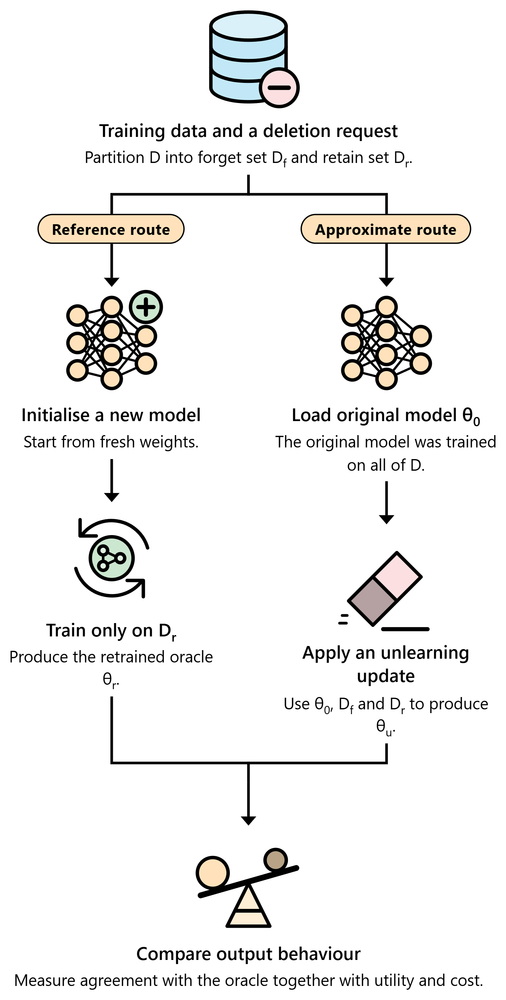
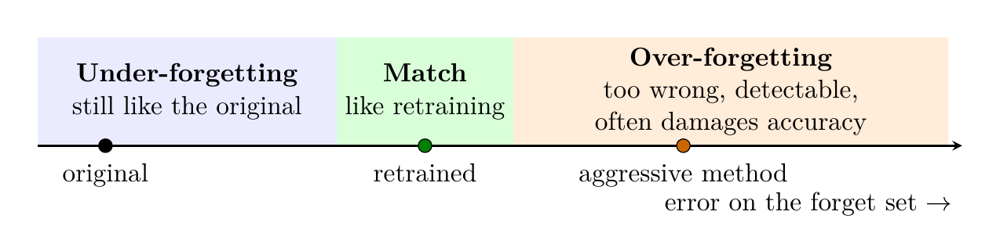
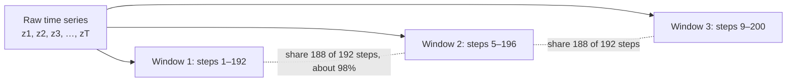
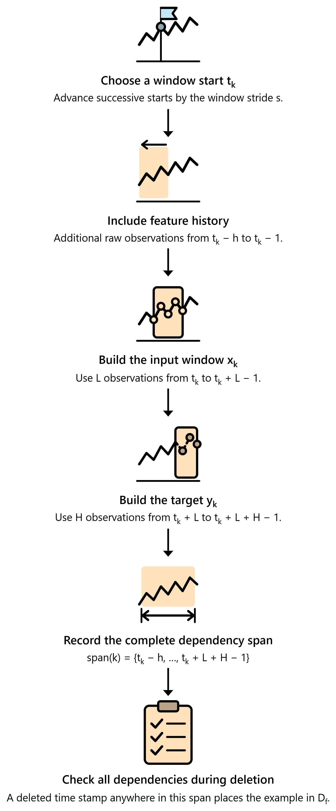
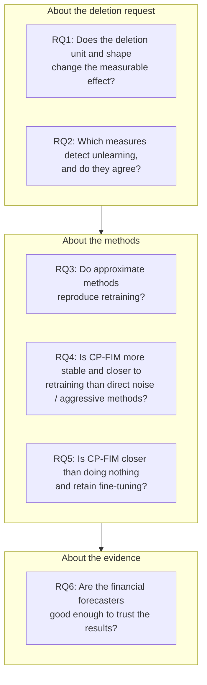
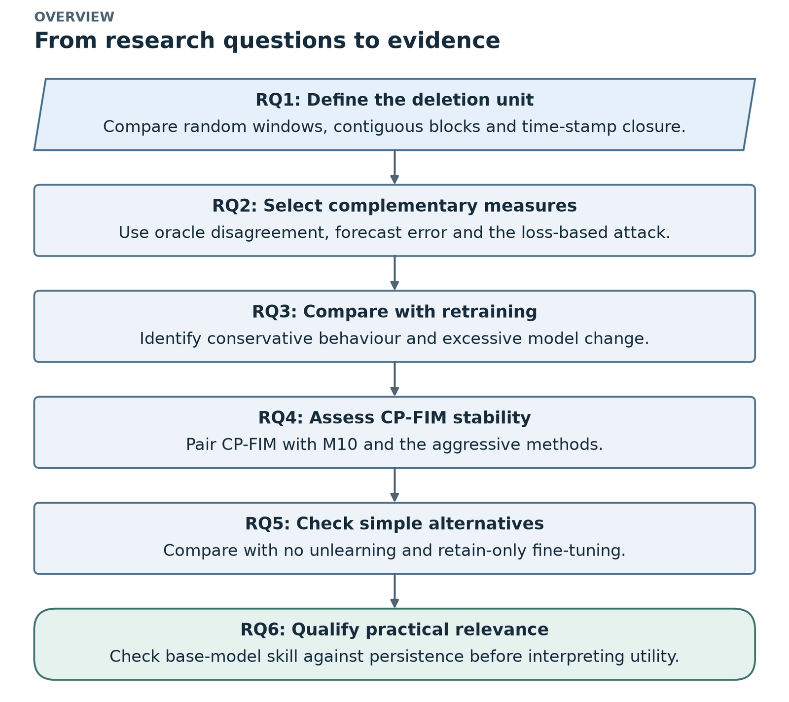
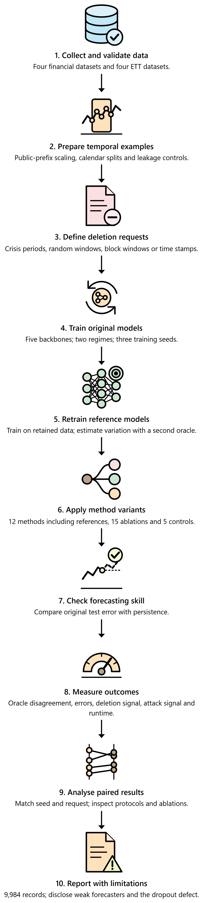

# 1. The big picture

*Thesis Chapter 1 (Introduction). ← [Back to README](../README.md) · Next: [Background and literature →](02_background_and_literature.md)*

---

## 1.1 What is machine unlearning?

Models are trained on personal, commercial and sensitive data. **After training, the model keeps traces of that data in its weights.** Deleting a row from a database does not remove those traces. Laws such as the EU GDPR (Article 17, "right to erasure") give people the right to ask for their data to be removed. Data owners may also need to remove wrong, poisoned or unusual records from a model that is already in use.

**Machine unlearning** = removing the influence of chosen training data from a trained model.

| Symbol | Name | Meaning |
|---|---|---|
| $D$ | training set | everything the model was trained on |
| $D_f$ | **forget set** | the part that must be removed |
| $D_r = D \setminus D_f$ | **retain set** | everything that stays |
| $\theta_0$ | **original model** (teacher) | trained on all of $D$ |
| $\theta_r$ | **oracle** (retrained model) | trained from scratch on $D_r$ only, the gold standard |
| $\theta_u$ | **unlearned model** (student) | the result of an approximate unlearning method |

There are two routes:

*Thesis Fig 1.1. Exact unlearning retrains on the retain set and gives the reference (the oracle). Approximate unlearning edits the existing model, which is cheaper.*

1. **Exact unlearning (retraining).** Train a brand-new model on $D_r$ only. It is correct by definition, but it costs a full training run every time someone asks for deletion. Note: the oracle may still infer *similar* information from correlated retained data. It excludes the examples; it is not a privacy certificate.
2. **Approximate unlearning.** Start from the original model and change it a little: extra gradient steps, noise, parameter masking and so on. It is cheaper, but it has to be checked against the oracle.

## 1.2 The key idea: "match retraining", not "be as wrong as possible"

The standard definition (Guo et al. 2020; Sekhari et al. 2021) says that an unlearned model should be **indistinguishable from a retrained model**. This idea runs through the whole thesis:

> A method that makes the model *very wrong* on the forget set is **not** doing better unlearning. A retrained model is usually *not* very wrong on data that looks like its training data. A very-wrong model is also easy to spot. Golatkar et al. call this the **Streisand effect**: deleting the data makes it *more* noticeable.

*Thesis Fig 1.2. The three possible outcomes. The goal is the green middle zone: behave like the retrained model.*

| Outcome | What happens | Which methods did this in our experiment |
|---|---|---|
| **Under-forgetting** | the model still behaves like the original | CP-FIM, retain fine-tuning, Fisher noise + FT, SCRUB-style, Contrast-FIM |
| **Match** | the model behaves like the retrained one | the target; *no method fully reached it* |
| **Over-forgetting** | forget error far above retraining; detectable; test accuracy often damaged | direct-noise (TS-Unlearn-inspired), retain label, max loss, gradient ascent |

## 1.3 Why forecasting makes unlearning harder

**Time-series forecasting** = predicting future values from past values, for example tomorrow's S&P 500 close or the next 96 hours of transformer load. The outputs are real numbers, so it is **regression**. Because the inputs are ordered in time, it is called **temporal regression**.

A forecaster is trained on **sliding windows**. Each window has $L$ past values (input) and the next $H$ values (target). Windows are cut every $s$ steps (the stride).

Two problems follow:

1. **Continuous outputs.** In classification you can check whether "forget accuracy dropped to zero". In regression there is no "wrong class", so you need a different yardstick. The thesis uses *distance to the retrained model's forecasts*.
2. **Overlapping windows.** With a 192-step window and stride 4, neighbouring windows share **188 steps (about 98%)**. Delete one window and its data is still in its neighbours. To truly delete an observation, you must delete **every window that touches it**. The thesis calls this **dependency closure**.

*Thesis Fig 4.3. A window's "span" = extra feature history (for example the history a moving average needs) + input window + forecast target. If any deleted time step falls inside the span, the window must go.*

**Consequence:** if a deletion request only removes *randomly chosen windows*, almost all of the raw observations stay in the training data through the neighbouring windows. Every unlearning method can then look better than it really is. This is a central finding (see [Results](08_results.md#finding-2-random-window-deletion-removes-almost-nothing-unique)).

## 1.4 Motivation (why this thesis exists)

- **Forecasting is everywhere and often sensitive.** Smart-meter data can show when a family is at home. Trading data can reveal a company's strategy. Membership attacks on forecasters have been shown to work (Johansson et al. 2025).
- **Unusual periods distort financial models.** The project started from finance. Crisis periods such as the COVID-19 crash or the 2022 bear market may need to be removed from a trained model.
- **Regression unlearning is under-studied.** Most work is on image classifiers with independent examples.
- **Deciding whether unlearning worked is hard.** The first forecasting-specific method, **TS-Unlearn** (Wang et al. 2026), judges success by how *large* the forget error gets, and it tests only random-window deletion. That conflicts with the "match retraining" definition.
- **Aggressive methods can break the model.** Gradient ascent and random targets can push error up on *all* data. In a deployed forecaster, a model that suddenly forecasts badly is worse than one that forgets slowly.

→ This motivates **CP-FIM**, a *stable* method, and a careful **retrain-referenced evaluation**.

## 1.5 Problem statement

Given a trained temporal regression model and a request to remove some training data, produce an updated model that:

1. **behaves as if the requested data had never been used** (close to the oracle);
2. **keeps useful forecasting performance** on retained and future data;
3. **costs less than full retraining.**

Four challenges make this hard:

| # | Challenge | Plain meaning |
|---|---|---|
| 1 | Ambiguous deletion units | One observation sits in many windows. "Delete" must say whether it means a window or a time stamp. |
| 2 | Incomplete evidence from one measure | Forget error alone proves nothing. Compare with retraining, account for seed noise, and check retain, test and a membership signal. |
| 3 | Removal versus retained utility | Push too hard and you damage forecasting. Push too little and nothing changes. |
| 4 | Uncertain agreement with retraining | Most methods were designed for classifiers. Check them against retraining on continuous, overlapping data. |

## 1.6 Objectives

1. Build a complete, repeatable pipeline for evaluating unlearning in forecasting (financial + ETT).
2. Design and evaluate a **stable** method, **CP-FIM**.
3. Compare CP-FIM with retraining, doing nothing, a TS-Unlearn-inspired direct-noise method and other approximate methods under the same settings.
4. Study how **deletion settings** (random windows, block windows, time stamps) change what is measured.
5. Use **several measures** (agreement with retraining, forecast error, membership test) and check whether they agree.
6. Study CP-FIM's **stability**.
7. Run **ablations** and **update-matched controls** to see which parts matter.
8. State the strengths, weaknesses and limits clearly.

## 1.7 The six research questions and their answers

| RQ | Answer (thesis Table 5.21) |
|---|---|
| **RQ1** | **The deletion protocol matters a lot.** Random-window deletion removes almost no unique information and usually changes the model no more than a new seed does. Block and time-stamp deletion remove much more and have clear effects. |
| **RQ2** | **The measures disagree.** Prediction agreement detects effects under standard training that the loss test cannot see. Under high-capacity training both detect them. |
| **RQ3** | **No approximate method reproduces retraining.** Gentle methods under-forget. Aggressive methods over-forget, become detectable and damage accuracy. |
| **RQ4** | **Yes.** CP-FIM is closer to retraining than the direct-noise adaptation in **56/56 settings (310/312 runs)** and than all five aggressive methods in **56/56**, while its test error stays within **−1.8% to +4.4%** in every run. |
| **RQ5** | **No.** CP-FIM beats doing nothing in only **22/56** settings; retain fine-tuning is closer in **41/56**. Its forget target keeps the teacher on average. |
| **RQ6** | **No.** The financial price-level models are much worse than persistence. A scale-free daily-change target reached roughly persistence level in a small pilot. |

The flowchart below maps each question to the evidence that answers it:

## 1.8 Methodology in brief (10 steps)

*Thesis Fig 1.3. The ten-stage research workflow.*

1. **Collect datasets.** 4 financial (2010–2024) + 4 ETT, with checks on values, dates and series identities.
2. **Prepare temporal examples.** Scale on a public early prefix, keep calendar order, cut windows, purge windows that cross split boundaries, and reserve held-out non-member windows for the attack.
3. **Specify deletion units.** Finance: 5 crisis periods by time stamp. ETT: random windows (20%), block windows (20%), time stamps (20% of raw steps + all dependent windows).
4. **Train original forecasters.** LSTM / GRU / BiLSTM / CNN-LSTM for finance, PatchTST for ETT, standard and high-capacity regimes, 3 seeds.
5. **Retraining reference.** For each request, train an oracle from scratch on the retained data, plus a **second oracle** with another seed to measure natural seed variation.
6. **Apply unlearning methods.** CP-FIM + 10 comparison methods + 15 ablations + 5 update-matched controls, all starting from the same original model.
7. **Check base forecasters.** Compare the original test error with a last-value **persistence** forecast.
8. **Measure deletion and utility.** Prediction disagreement on forget, retain and test windows; forecast error; deletion signal ratio; loss-attack AUC; cost; stability.
9. **Analyse paired outcomes.** Same seed, same request; by dataset, architecture, regime and protocol; plus ablations and controls.
10. **Report limitations.** Stability is not forgetting; disclose the attention-dropout defect; qualify the finance results.

## 1.9 Scope (what is in and out)

| In scope | Out of scope |
|---|---|
| **Model-level** unlearning for forecasting models | Deleting raw data files; the fixed public scaling step |
| 8 datasets, 5 model types, 2 regimes | Arbitrary forecasting systems or much larger models |
| Offline unlearning: the request arrives after training | Detecting automatically *what* should be deleted |
| Known deletion periods / requests | Crisis or event detection systems |
| Agreement with retraining, error, skill vs persistence, loss-attack, stability, cost | Formal privacy certificates and strong shadow-model attacks |

**Challenges named in the thesis:** overlapping windows · randomness in retraining (two oracles disagree) · limits of membership testing ("no signal" ≠ "no memory") · difficulty of price-level forecasting · different deletion settings · measures that disagree · large experimental cost (≈74 GPU-hours) · software issues (the attention-dropout defect) · known deletion requests only.

---

### Check yourself

Why is a high forget error not proof of good unlearning?

Because the target is the *retrained* model. A retrained model usually forecasts the forget windows reasonably well, since they look like its training data. A much higher error means **over-forgetting**. It is detectable (membership AUC drops *below* the oracle's) and it usually damages test accuracy too.

What is dependency closure in one sentence?

When a raw time step is deleted, every training window whose span (feature history + input + target) contains that time step must also be deleted.

What are the three reference points every result is read against?

The **oracle** (retrained model, the target), the **original model** (doing nothing, the lower reference) and the **retrain variation** (how much two oracles with different seeds disagree, the natural noise floor).

