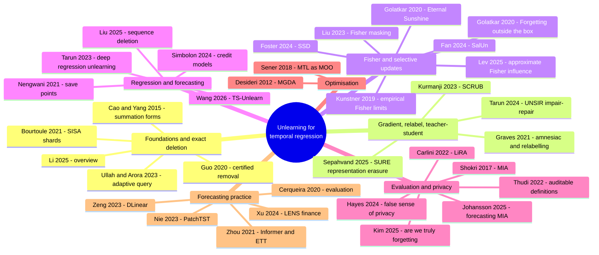
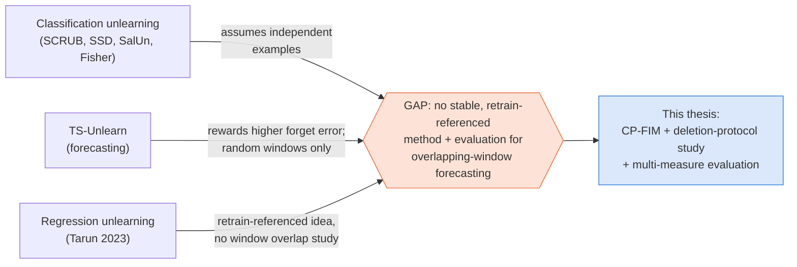

# 2. Background and literature

*Thesis Chapter 2 (Literature Review). ← [Big picture](01_big_picture.md) · Next: [Data and deletion requests →](03_data_and_deletion.md)*

---

## 2.1 Preliminaries: twelve concepts you must know

| # | Concept | Plain explanation | Where it shows up |
|---|---|---|---|
| 1 | **Reasons for unlearning** | Privacy requests, incorrect records, contaminated or poisoned data. Deleting a stored record does not change parameters learned from it. | Motivation |
| 2 | **Time-series forecasting** | Look-back length $L$ = what the model sees; horizon $H$ = what it predicts. Finance: next-day close. ETT: 96 future steps × 7 channels. | Data |
| 3 | **Sliding windows and temporal dependence** | Adjacent windows reuse observations. Window deletion ≠ observation deletion. | Deletion protocols |
| 4 | **Forecasting models** | LSTM / GRU (gated recurrence), BiLSTM (reads the input both ways), CNN-LSTM (convolutions first), PatchTST (patches + channel-independent attention). | Models |
| 5 | **Exact vs approximate unlearning** | Exact reproduces training on $D_r$; approximate edits $\theta_0$ to get close at lower cost. Similar forecasts are not a formal guarantee. | Whole thesis |
| 6 | **Retraining as the reference** | Two retrained models differ because of seeds, so compare with *both* the oracle and the oracle-to-oracle variation. | DSR, RNC |
| 7 | **Granularity of deletion** | Examples, time stamps, contiguous periods or whole entities. Each removes a different amount of unique information. | RQ1 |
| 8 | **Fisher information** | Diagonal empirical Fisher = average squared per-example gradient ≈ how sensitive the loss is to each parameter. It is a heuristic, not a measure of "stored information" (Kunstner et al. 2019). | CP-FIM step 1–2 |
| 9 | **Multi-objective optimisation (MGDA)** | Picks the minimum-norm mix of two gradients so that both losses can improve. A zero retain gradient at the start makes the unconstrained mix stall. | CP-FIM step 4 |
| 10 | **Membership inference** | An attack that tries to tell training examples from unseen ones. Low loss suggests "member". LiRA and shadow models are stronger attacks. Our loss-AUC is exploratory. | AUC results |
| 11 | **Forecasting measures** | MSE / RMSE / MAE for error; persistence as the minimum skill check; prediction disagreement for closeness to the oracle. | Metrics |
| 12 | **Core challenges** | Overlap keeps deleted information; continuous outputs make "high forget error" ambiguous; strong updates harm utility; weak base models limit interpretation. | Design |

## 2.2 Review of existing research, organised by idea

### A. Foundations, exact deletion and retraining references

| Paper | Key idea | What this thesis takes from it |
|---|---|---|
| **Cao & Yang (2015)**, *Towards Making Systems Forget* | Write learning in a summation form; delete by subtracting one record's contribution. | Exact deletion can be cheap, but deep forecasters do not have that form. |
| **Bourtoule et al. (2021)**, *SISA* | Train on isolated shards/slices; on deletion, retrain only the affected shard. | For time series the isolation unit must include **all overlapping windows**. Suggested as future work. |
| **Guo et al. (2020)**, *Certified Data Removal* | Formal certified removal for convex models; the unlearned model should resemble one trained without the data. | The "match retraining" definition. Our methods are checked empirically, **without** claiming certification. |
| **Ullah & Arora (2023)**; **Li et al. (2025)** | Adaptive-query view of unlearning; surveys of exact vs approximate. | Clarify assumptions. They do not solve deep forecasting deletion. |

### B. Gradient updates, relabelling and teacher–student methods

| Paper | Key idea | Thesis link |
|---|---|---|
| **Graves et al. (2021)**, *Amnesiac ML* | Relabelling; storing and reversing batch updates. | Basis of **M12 (noisy label)** and **M13 (retain label)**. |
| **Kurmanji et al. (2023)**, *SCRUB* | Alternate forget and retain objectives with a teacher; SCRUB+R limits excessive forgetting. | Basis of **M5 (SCRUB-style)**. Warns that unusually high forget error can identify the deleted data. |
| **Tarun et al. (2024)**, *UNSIR* | Impair with noise, then repair on retained data. | Noise-then-repair idea (class removal, different setting). |
| **Sepahvand et al. (2025)**, *SURE* | Domain-adversarial representation erasure. | Representation-level view that complements output tests. |

### C. Fisher information and selective parameter updates

| Paper | Key idea | Thesis link |
|---|---|---|
| **Golatkar et al. (2020)**, *Eternal Sunshine of the Spotless Net* | Scrub weights with curvature (Fisher) and calibrated noise; aggressive changes make deleted data *more* noticeable. | Basis of **M6 (Fisher noise + FT)** and **M3 (anchored ascent)**. Source of the **Streisand effect** we observe. |
| **Liu et al. (2023)**, *Fisher Masking* | Mask parameters important to the forget set, then fine-tune. | Motivates parameter selection. |
| **Foster et al. (2024)**, *SSD* | Dampen parameters much more important for the forget set than for the full data. | **Warning:** if the forget set looks like the rest of the data, importance does not separate them. That matches our finding that the Fisher contrast had no measurable effect. |
| **Fan et al. (2024)**, *SalUn* | Restrict updates to salient parameters. | Same trade-off: concentrate the change, preserve the rest. |
| **Kunstner et al. (2019)** | The empirical Fisher can differ a lot from the true Fisher. | CP-FIM's contrast is a **heuristic**, so it must be tested by ablation, which we did. |
| **Lev et al. (2025)**; **Golatkar et al. (2020b)** | Approximate Fisher influence; black-box scrubbing. | Need task-specific validation. |

### D. Regression, sequential data and forecasting unlearning

| Paper | Key idea | Thesis link |
|---|---|---|
| **Tarun et al. (2023)**, *Deep Regression Unlearning* | A "blindspot" model trained without the forget data, plus Gaussian fine-tuning; includes electricity forecasting. | Principle: compare forget and retain behaviour **with retraining**. There is no "wrong label" in regression. |
| **Wang et al. (2026)**, *TS-Unlearn* | Teacher–student; forget predictions pushed toward **noise**; MGDA balances the objectives; PatchTST; **random-window** deletion (10–40%). | Basis of **M10 (direct-noise adaptation)**. Our critique: it rewards **higher** forget error and tests only random deletion. |
| **Liu et al. (2025)**, sequence deletion (knowledge tracing) | One observation contributes to several related examples. | Motivates **dependency closure**. |
| **Nengwani et al. (2021)**; **Simbolon & Gambetta (2024)** | Save points for regression; certified removal for credit models. | Explicit deletion sizes and a retraining reference matter. |

### E. Membership inference and reliable evaluation

| Paper | Key idea | Thesis link |
|---|---|---|
| **Shokri et al. (2017)** | Shadow-model membership inference. | Good accuracy ≠ no leakage. |
| **Carlini et al. (2022)**, *LiRA* | Likelihood-ratio attack; evaluate at low false-positive rates. | One AUC is **not** a privacy certificate. LiRA is future work. |
| **Johansson et al. (2025)** | Record- and user-level membership inference on **forecasters**. | Forecasters can leak; choose time-comparable non-members. |
| **Kim et al. (2025)**; **Hayes et al. (2024)** | Output-based and representation-based checks disagree; weak attacks give a false sense of privacy. | Supports using **several measures**, and treating disagreement as a result. |
| **Thudi et al. (2022)**; **Ahmad et al. (2026)**; **Berriche (2025)** | Auditable definitions; privacy–performance studies; benchmarking. | Report several measures; do not infer removal from one score. |

### F. Multi-objective optimisation

| Paper | Key idea | Thesis link |
|---|---|---|
| **Désidéri (2012)**, *MGDA* | Minimum-norm point in the convex hull of the objective gradients. | CP-FIM's Pareto weight $\alpha$. |
| **Sener & Koltun (2018)** | Multi-task learning as multi-objective optimisation; closed form for 2 tasks. | Closed-form two-gradient weight. |
| *Thesis observation* | If the retain-distillation gradient is **exactly zero** (student = teacher at step 1), the min-norm mix is zero and the update **stalls**. | Safeguards: warm-up + floor/ceiling. |

### G. Forecasting architectures and baseline practice

| Paper | Key idea | Thesis link |
|---|---|---|
| **Zhou et al. (2021)**, *Informer* | Efficient long-sequence attention; released the **ETT** benchmark. | ETT data. |
| **Nie et al. (2023)**, *PatchTST* | Patches + channel independence; a strong long-horizon forecaster. | ETT model. |
| **Zeng et al. (2023)**, *DLinear* | A one-layer linear model beats many Transformers. | Always check against **naive baselines**. |
| **Cerqueira et al. (2020)** | Performance estimation for time series. | Chronological splits, purged boundaries. |
| **Xu et al. (2024)**, *LENS*; stock-prediction papers (2024–2025) | Financial series are hard to forecast. | Explains why our price-level models fail persistence. |
| **Hochreiter & Schmidhuber (1997)**; **Cho et al. (2014)**; **Schuster & Paliwal (1997)** | LSTM, GRU, bidirectional RNN. | Finance models. |

## 2.3 Summary of key findings from the literature: the gap

Three lessons guide the thesis:

1. **Deletion semantics must be explicit.** Does a request remove *windows* or *raw observations*? Every dependent window has to be handled.
2. **Retraining is the behavioural reference**, with **multiple seeds** so a deletion effect can be told apart from training noise.
3. **Forecasting skill and privacy diagnostics must be reported alongside prediction agreement**, because a change in one measure need not improve another.

**Where CP-FIM sits:** an approximate forecasting method that combines an empirical-Fisher contrast, a teacher-anchored noisy target and safeguarded gradient mixing. It is evaluated inside a broader study of temporal deletion, and the conservative behaviour and failed comparisons are reported along with the favourable results.

