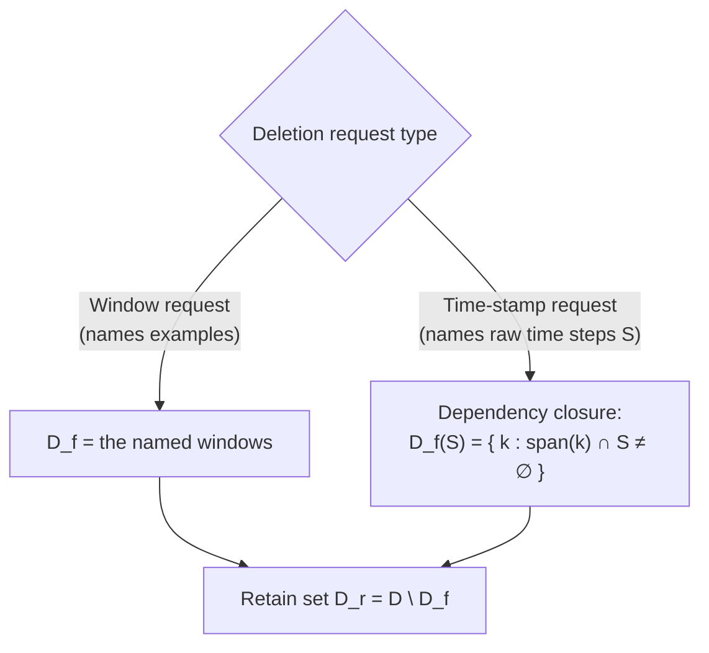
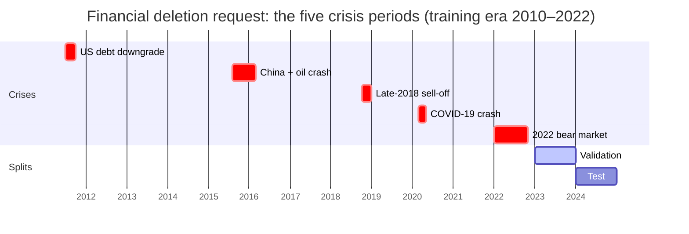

# 3. Data and deletion requests

*Thesis Section 4.4 (Data and Target (Forget) Set Creation). ← [Background](02_background_and_literature.md) · Next: [Models and training →](04_models_and_training.md)*

---

## 3.1 The eight datasets (Table 4.11)

| Dataset | Content | Frequency | Period / splits |
|---|---|---|---|
| **SP500** | S&P 500 index (^GSPC) | Daily | 2010–2024; train < 2023, validation 2023, test 2024 |
| **NASDAQ** | NASDAQ Composite (^IXIC) | Daily | same as SP500 |
| **MultiStock** | 20 large US stocks: AAPL, MSFT, GOOGL, AMZN, META, TSLA, NVDA, JPM, JNJ, V, WMT, PG, XOM, BAC, MA, HD, CVX, ABBV, PFE, COST | Daily | same as SP500 |
| **MixedAssets** | Gold (GC=F), crude oil (CL=F), US 10-year yield (^TNX), EUR/USD | Daily | same as SP500 |
| **ETTh1, ETTh2** | Electricity transformer: oil temperature + 6 load features = **7 channels** | Hourly | 12 / 4 / 4 months (train / val / test) |
| **ETTm1, ETTm2** | Same as above | 15 minutes | 12 / 4 / 4 months |

**The two families have different jobs:**

| | Financial | ETT |
|---|---|---|
| Role | Crisis-period deletion on daily market series | Controlled comparison of random vs block vs time-stamp deletion on a standard benchmark |
| Inputs | 5 features per asset: close, volume, daily return, 5-day MA, 10-day MA | 7 channels |
| Window | **30 trading days → next-day closing price** (a price *level*) | **96 steps → next 96 steps**, all 7 channels |
| Stride | 1 day | **4 steps** (heavy overlap) |
| Model | LSTM, GRU, BiLSTM, CNN-LSTM | PatchTST |
| Trust level | ⚠️ the price-level models **lose to persistence**, so the results are descriptive only | ✅ **main evidence**: the models beat persistence |


## 3.2 Pre-processing and leakage control

**Leakage** = future or evaluation data influencing training. Four controls prevent it:

1. **Public scaling prefix.** The scaler is fitted only on a short prefix at the start (the first **126 trading days** for finance, the first **7 days** for ETT). The prefix is never trained on and is outside the deletion scope, so scaling cannot leak and does not depend on the deleted data.
2. **Calendar splits.** Train → validation → test strictly in time order.
3. **Purged boundaries.** Any window whose input or target crosses a split boundary is removed.
4. **Attack hold-out.** About 5% of each tenth of the training era is held out as **non-member** blocks for the membership test. They come from the same period but are never trained on.


*Thesis Fig 4.7 (not to scale). Grey = public prefix, blue = training era, red stripes = held-out attack blocks, white gaps = purged boundaries.*


## 3.3 Two kinds of deletion request




The **span** of example $k$ (starting at time $t_k$, with feature history $h$):

```math
\mathrm{span}(k) = \{\, t_k - h, \dots, t_k + L + H - 1 \,\}
```

A time-stamp request $S$ deletes every example whose span touches $S$:

```math
D_f(S) = \{\, k : \mathrm{span}(k) \cap S \neq \emptyset \,\}, \qquad D_r = D \setminus D_f(S)
```

### Dependency closure algorithm (thesis Algorithm 2)

```text
Input:  window starts t_1..t_N, look-back L, horizon H, feature history h, deleted steps S
Output: forget set D_f, retain set D_r

D_f ← ∅
for k = 1..N:
    span(k) ← {t_k − h, …, t_k + L + H − 1}
    if span(k) ∩ S ≠ ∅:
        D_f ← D_f ∪ {k}          # the window uses a deleted observation
D_r ← {1..N} \ D_f
return D_f, D_r
```


*Thesis Fig 4.9. The per-window decision. After closure, no retained window contains any deleted observation in its input, its target or its derived-feature history.*

## 3.4 Financial request: five crisis periods (Table 4.12)

Every training window touching one of these periods is removed. A window uses 30 input days, and the 10-day moving average needs **9 extra days of history ($h = 9$)**, so a crisis also removes the windows just before and after it. This is a **time-stamp request with dependency closure**.

| # | Event | Start | End |
|---|---|---|---|
| 1 | US debt downgrade and European debt stress | 2011-07-01 | 2011-09-30 |
| 2 | China market turbulence and oil price crash | 2015-08-01 | 2016-02-29 |
| 3 | Late-2018 market sell-off | 2018-10-01 | 2018-12-31 |
| 4 | COVID-19 crash | 2020-02-20 | 2020-04-30 |
| 5 | 2022 inflation shock and bear market | 2022-01-01 | 2022-10-31 |




## 3.5 ETT: three deletion protocols

Each protocol is repeated with **three random requests (seeds 101, 202, 303)**.

| Protocol | What is removed | Windows removed | Why it exists |
|---|---|---|---|
| **Random windows** | 20% of training windows chosen at random | 20% | This is **TS-Unlearn's protocol** |
| **Block windows** | the same 20% of windows, as **6 contiguous blocks** | 20% | Same *amount* as random, different *shape* |
| **Time stamps** | 20% of **raw time steps** in 6 blocks + **every window** using them ($h = 0$) | **24–35%** | "True" deletion of observations |


*Thesis Fig 4.8 (illustration). Random deletion leaves kept neighbours beside every deleted window. Block deletion removes contiguous runs. Time-stamp deletion also removes every window overlapping the deleted steps, so it removes more windows.*

**Key reasoning:** random and block remove the **same number** of windows, so any difference between them comes from the **shape** of the deletion. Time-stamp deletion removes **more** windows, so part of its effect may come from the larger amount (shape and amount are not fully separated, which is listed as a limitation).

| Random | Block | Time stamp |
|---|---|---|
|  |  |  |

## 3.6 Size of the splits (Table 4.13, one representative request)

| Dataset | Train | Forget | Validation | Test | Held-out (attack) |
|---|---:|---|---:|---:|---:|
| SP500 / NASDAQ | 2,567 | 672 (26.2%) | 211 | 213 | 540 |
| ETTh1 / ETTh2 (random, block) | 1,487 | 297 (20.0%) | 673 | 673 | 584 |
| ETTh1 / ETTh2 (time stamp) | 1,487 | 502–527 (33.8–35.4%) | 673 | 673 | 584 |
| ETTm1 / ETTm2 (random, block) | 7,525 | 1,505 (20.0%) | 2,833 | 2,833 | 900 |
| ETTm1 / ETTm2 (time stamp) | 7,525 | 1,777–1,826 (23.6–24.3%) | 2,833 | 2,833 | 900 |

## 3.7 How much *unique* information each protocol removes

This is measured later (Results, Finding 2), but it belongs with the protocols. "Rows without support" = raw time steps that were covered by deleted windows and by **no** kept window. These are the observations that are truly gone.

| Protocol | Raw time steps with no remaining support | Windows deleted |
|---|---|---|
| ETT random | **16–32** | 20% |
| ETT block | 436–5,456 | 20% |
| ETT time stamp | 1,820–6,928 | 24–35% |

Under random deletion, **97.3–99.7% of the deleted windows are fully covered by kept neighbours**. The nearest kept window is typically only **4 steps** away.


---

### Check yourself

<details><summary>Why fit the scaler on a public prefix instead of the whole training set?</summary>

If the scaler used the whole training era, its mean and variance would depend on the deleted data. A retrained model would then need a different scaler, and future information could leak. Fitting it on an early prefix that is never trained on and is outside the deletion scope avoids both problems.
</details>

<details><summary>Random and block deletion remove the same 20% of windows. Why do they give such different results?</summary>

Because of overlap. A randomly deleted window almost always has kept neighbours that contain nearly the same observations, so the raw data is still in training (only 16–32 raw steps lose all support). A contiguous block removes whole stretches of time that no kept window covers (436–5,456 steps).
</details>

<details><summary>Why is h = 9 for finance?</summary>

The 10-day moving-average feature needs 9 extra past days on top of the 30-day input window. Those days are part of each window's span, so they count in the dependency closure.
</details>
