# 4. Forecasting models, training regimes and the experiment grid

*Thesis Sections 4.5 and 4.8. ← [Data and deletion](03_data_and_deletion.md) · Next: [CP-FIM →](05_cpfim_method.md)*

---

## 4.1 The five architectures (Table 4.14)

Width $d$ = **128** (standard regime) or **256** (high-capacity regime).

| Model | Layers | Output head | Used on |
|---|---|---|---|
| **LSTM** | 3-layer LSTM (hidden size $d$), dropout between layers | linear(64) → ReLU → dropout → linear(1) | Finance |
| **GRU** | 3-layer GRU (hidden size $d$) | same head | Finance |
| **BiLSTM** | 3-layer bidirectional LSTM ($d$ per direction); reads the **observed input window** both ways and never sees future targets | same head | Finance |
| **CNN-LSTM** | 2 × Conv1D (64 and 128 filters, kernel 3, ReLU) → dropout → 3-layer LSTM | same head | Finance |
| **PatchTST** | instance normalisation; patch length 16, stride 8 → **11 patches**; linear patch embedding + learned positions; 3 pre-norm Transformer layers, 8 heads, FFN size $4d$, GELU | flatten → dropout → linear to 96 steps per channel | ETT |

**How each one works, in one line:**

- **LSTM:** input, forget and output gates control what is stored in and exposed from the cell state as it reads the 30-day sequence in order.
- **GRU:** update and reset gates, with no separate cell state, so it is structurally simpler than LSTM.
- **BiLSTM:** one stack reads forward and one reads backward over the input window; their final states are joined.
- **CNN-LSTM:** convolutions pick out short local patterns, then the LSTM models how they develop over time.
- **PatchTST:** each of the 7 channels is processed *independently*. It is cut into overlapping patches, embedded, and passed through a Transformer encoder. Patches shorten the attention sequence while keeping local patterns.

| LSTM | GRU |
|---|---|
| 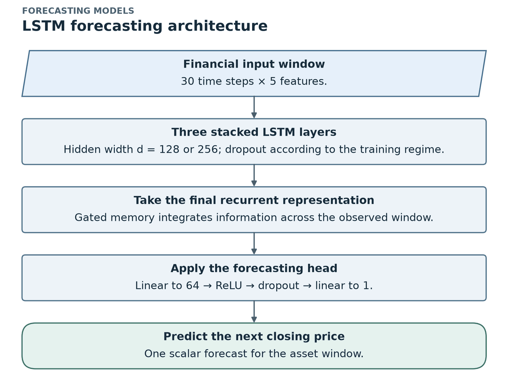 | 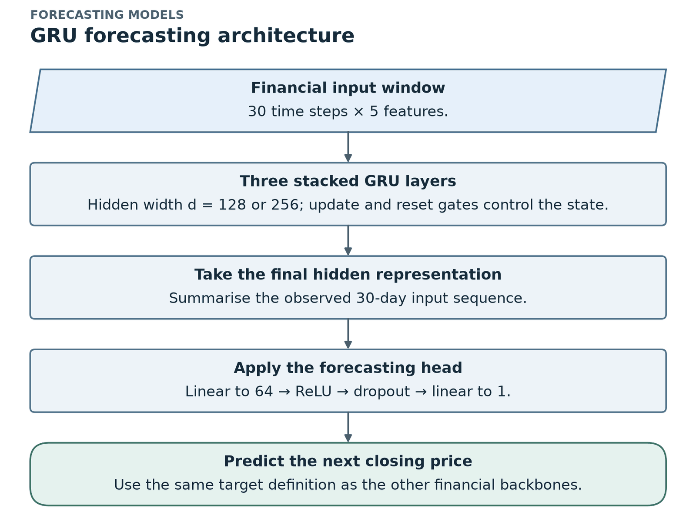 |
| **BiLSTM** | **CNN-LSTM** |
| 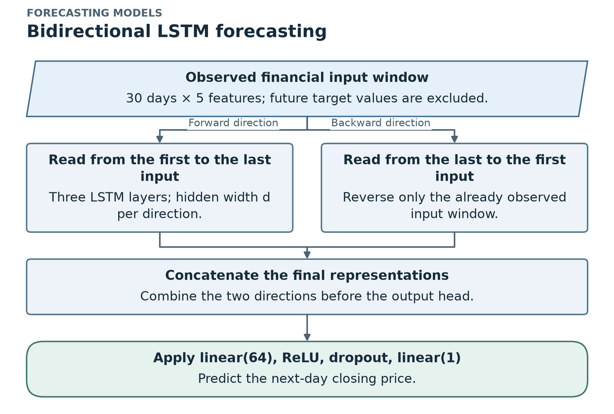 | 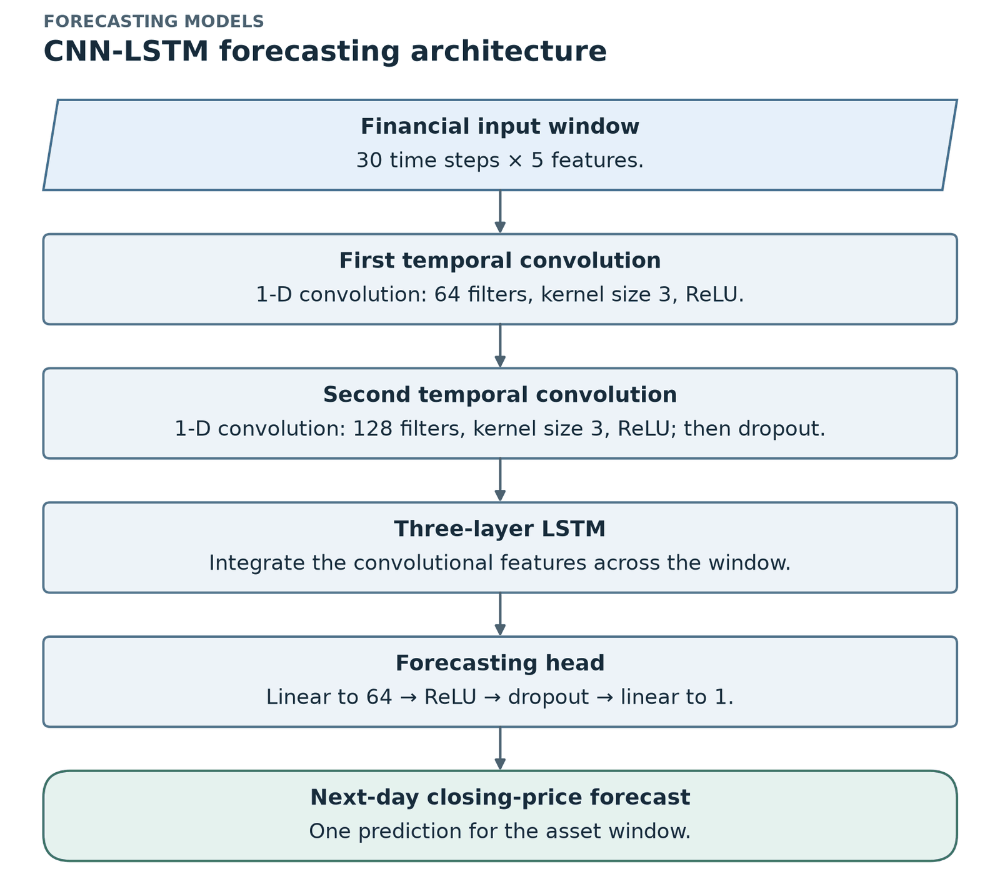 |

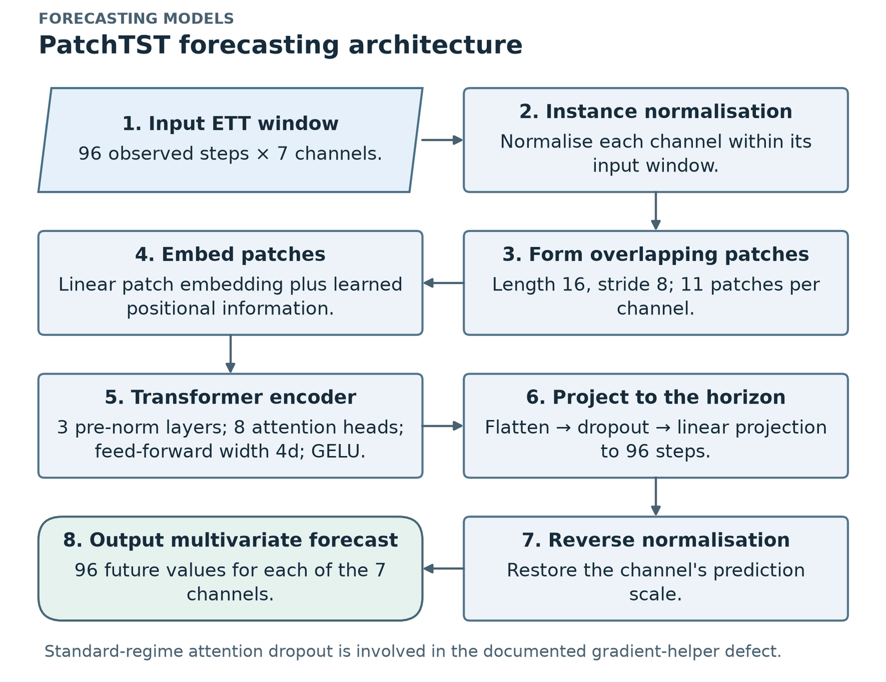

> ⚠️ **PatchTST note:** in the **standard regime** (dropout 0.3), the attention dropout stayed active inside the gradient helper used by the Fisher/Pareto methods. This is the **attention-dropout defect**, explained in [chapter 9](09_fixes_statistics_robustness.md#92-the-attention-dropout-defect).

## 4.2 Two training regimes (Table 4.15)

Shared by both regimes: Adam, learning rate $5\times10^{-4}$, cosine schedule, batch size 512, gradient clipping at 1.0.

| Setting | Standard | High-capacity |
|---|---|---|
| Hidden size / width | 128 | 256 |
| Dropout | 0.3 | 0.0 |
| Weight decay | $10^{-5}$ | 0 |
| Max epochs | 150 | 500 (1,000 if ≥ 20,000 examples) |
| Early stopping | patience 40 | none |
| Checkpoint used | best validation epoch | final epoch |

**Why two regimes?**

- **Standard** = a normal, regularised forecasting setup.
- **High-capacity** = designed to make **memorisation more likely**, so the deletion diagnostics (DSR, membership AUC) have a stronger signal.

> The regimes change **five settings at once**, so a difference between them cannot be traced to one setting (for example width alone). This is a stated limitation.

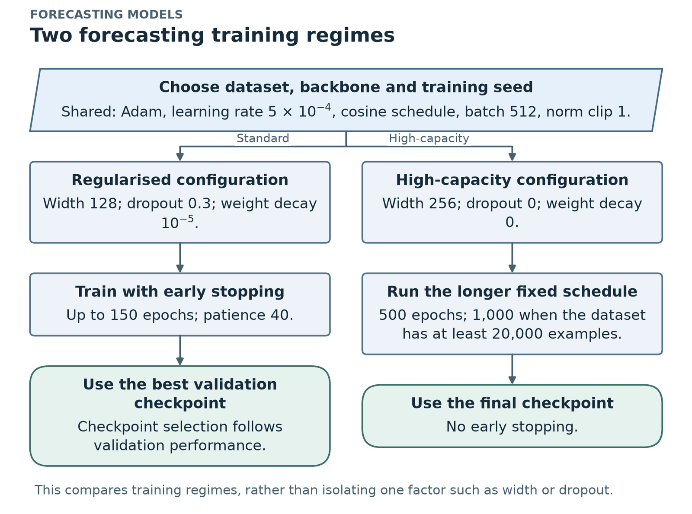

## 4.3 The experiment grid

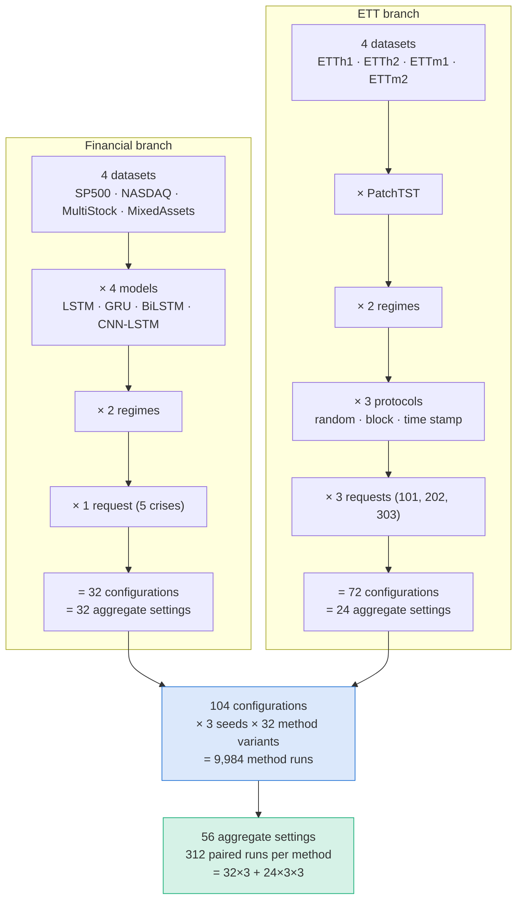

### Size of the final experiment (Table 4.20)

| Item | Count |
|---|---:|
| Financial configurations (4 datasets × 4 models × 2 regimes × 1 request) | 32 |
| ETT configurations (4 datasets × PatchTST × 2 regimes × 3 protocols × 3 requests) | 72 |
| Method variants per seed (12 methods incl. references + 15 ablations + 5 controls) | 32 |
| Seeds per configuration | 3 |
| **Total method runs** (104 × 3 × 32) | **9,984** |
| Aggregate settings (dataset × model × regime × protocol) | 56 |
| Paired runs per method (settings × requests × seeds) | 312 |
| Compute time | about 74 GPU-hours |

**Know the two "counting units" well. Examiners like to ask about them:**

- A **setting** = dataset × model × regime × protocol. There are **56**: 32 finance + 24 ETT. "56/56" means *every* setting.
- A **paired run** = one setting × one request × one seed, where two methods are compared on the **same** original model, oracle, seed and request. There are **312** per method: finance 32 × 3 = 96, ETT 24 × 3 requests × 3 seeds = 216.

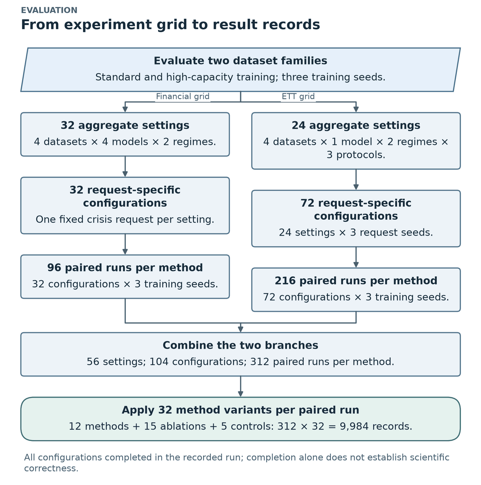

## 4.4 What runs for every configuration and seed

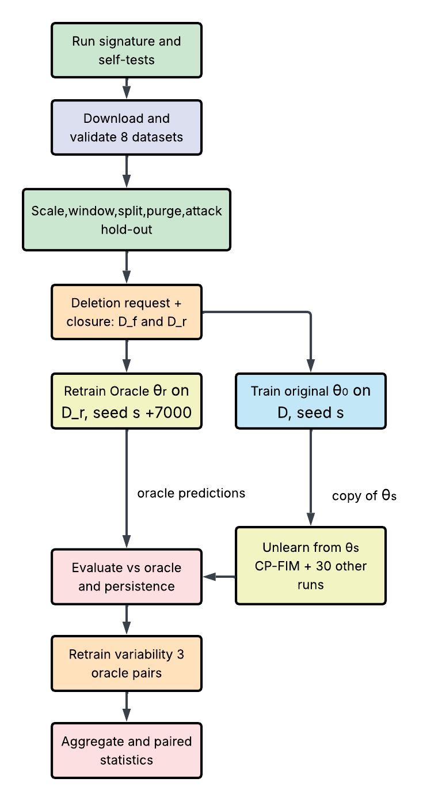
*Thesis Fig 4.10. Self-tests → data validation → windows/splits/purge/attack hold-out → deletion request + closure → original model (seed s) and oracle (seed s + 7000) → unlearning from a copy of the original ("CP-FIM + 30 other runs") → evaluation vs the oracle and persistence → retrain variability (3 oracle pairs) → aggregation and paired statistics.*

## 4.5 Implementation and reproducibility

- **One Jupyter notebook in PyTorch**, run on **one RTX 4070 Ti SUPER (16 GB)**.
- **Built-in self-tests run first**: Fisher values checked against an analytic result, exact block sizes, rejection of non-finite values and checkpoint recovery. All 8 datasets are validated. The notebook **stops if any check fails**.
- **Run signature** = configuration + code fingerprint + data hashes, so results from different code or data can never be mixed.
- **Checkpointing** every epoch, every 250 updates or every 30 minutes, with resume and no repeated work.
- **Result:** all 104 configurations finished, **0 method runs failed**.
- **Compute split:** 9.6 h original models + 17.6 h retrained references + 47.2 h unlearning methods ≈ 74 GPU-hours.

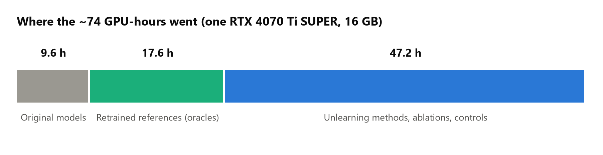

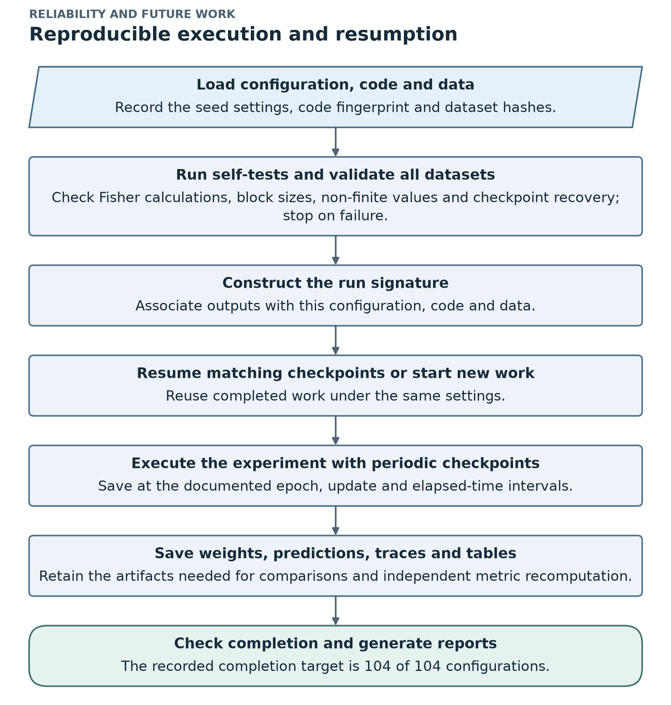

| Software | Version |
|---|---|
| Python | 3.11 |
| PyTorch | 2.11 with CUDA 12.8 |
| Others | NumPy, pandas, scikit-learn, Matplotlib, Jupyter |
| Seeds | training 42, 43, 44; oracle = seed + 7000; ETT requests 101, 202, 303 |
