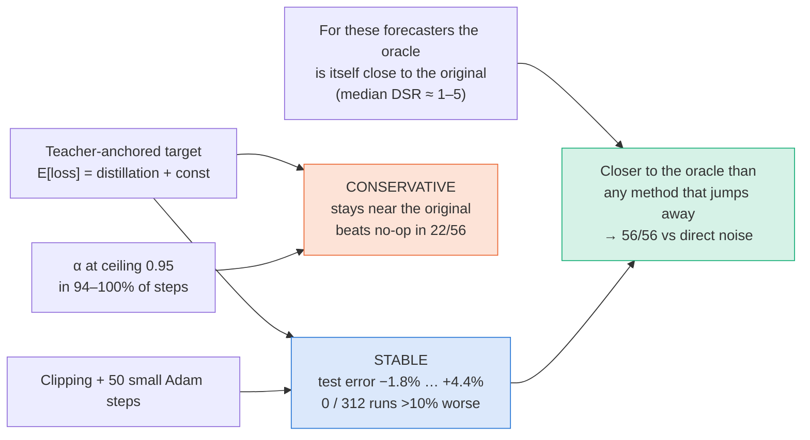

# 5. CP-FIM: the proposed method

*Thesis Sections 4.1–4.3 (Design process, alternatives, selected design). ← [Models](04_models_and_training.md) · Next: [Comparison methods →](06_comparison_methods.md)*

**CP-FIM = Contrast-Preconditioned Fisher Information Matrix unlearning** (method ID **M9**).

---

## 5.1 The idea in plain words

> **Change most the parameters that matter much more to the forget data than to the retain data. Never push the forecasts far away: on the forget data, ask the model to match the teacher's own forecast plus a small noise of normal-error size. On the retain data, ask it to copy the teacher. Mix the two gradients with a safeguarded Pareto weight, and clip everything.**

**Analogy.** Picture a teacher and a student who starts as an exact copy of the teacher. On the "forget" pages the student is told: "Answer roughly like the teacher, but blur your answer by about as much as the teacher usually gets wrong." On the "retain" pages: "Answer exactly like the teacher." The student is only allowed small, clipped steps, and only for 50 steps.

## 5.2 Three model roles


*Thesis Fig 4.1. The **original** model (M1) is the starting point of every approximate update. The **oracle** (M2, retrained on $D_r$) and a **second oracle** (different seed) are evaluation references only. **An unlearning method never sees the oracle.***

## 5.3 How the design was reached


*Thesis Fig 4.2. Objectives → alternatives → specification → verification (reviews, tests, pilots; loop back to redesign when problems are found) → selected design CP-FIM → full evaluation and final adjustments.*

### Design objectives and constraints (Table 4.1)

| ID | Objective / constraint | Meaning |
|---|---|---|
| **O1** | Fidelity | Behave like the oracle (small prediction disagreement), not just have a large forget error |
| **O2** | **Stability** | Never damage the model: test error stays near the original in every run; the update stays bounded. **This became CP-FIM's main strength.** |
| **O3** | Efficiency | Cost clearly less than retraining |
| **O4** | Generality | Work for recurrent nets *and* Transformers, finance *and* energy |
| **O5** | Rigorous evaluation | Check every claim against retraining, retraining randomness and simple baselines |
| C1 | Hardware | One RTX 4070 Ti SUPER (16 GB), ≈ 74 GPU-hours |
| C2 | Repetition | 3 training seeds per setting (3 requests per ETT setting) |
| C3 | Budget | **50 update steps** for CP-FIM and the Pareto-based methods |
| C4 | **No oracle at unlearning time** | A method may use the original model, $D_f$ and $D_r$, never the retrained model |

### The formal goal

```math
\theta_0 = A(D), \qquad \theta_r = A(D_r), \qquad \theta_u = U(\theta_0, D_f, D_r)
```

```math
\theta_u \approx \theta_r \ \text{(in behaviour)}, \qquad
\mathrm{MSE}_{\text{test}}(\theta_u) \approx \mathrm{MSE}_{\text{test}}(\theta_0), \qquad
\mathrm{cost}(U) \ll \mathrm{cost}(A)
```

"Behaviour" is measured through forecasts, because deep models have no usable guarantee. See [prediction disagreement](07_evaluation_metrics.md#71-prediction-disagreement-the-core-measure).

## 5.4 The teacher–student structure


*Thesis Fig 4.4. A frozen teacher ($\theta_0$) and an updating student (it starts as a copy). Each step takes one forget batch and one retain batch, computes two losses, and mixes their gradients with a safeguarded Pareto weight.*

## 5.5 The five steps

### Step 1: Fisher information estimation

Estimate the **empirical diagonal Fisher** of every parameter $i$ on samples from the forget and retain sets: up to **500** examples each (**1,000** if the dataset has ≥ 20,000 examples). Each example's gradient is computed **separately** and squared:

```math
F^{f}_i = \frac{1}{|S_f|}\sum_{(x,y)\in S_f}\left(\frac{\partial \ell(x,y;\theta_0)}{\partial \theta_i}\right)^2,
\qquad
F^{r}_i = \frac{1}{|S_r|}\sum_{(x,y)\in S_r}\left(\frac{\partial \ell(x,y;\theta_0)}{\partial \theta_i}\right)^2
```

$\ell$ = squared error. Intuition: $F_i$ is large when nudging parameter $i$ changes the loss on that data a lot.


### Step 2: Contrast preconditioning

A parameter is **forget-specific** when its forget Fisher is large compared with its retain Fisher:

```math
c_i = \frac{F^{f}_i}{F^{r}_i + \lambda \bar{F}^{r}}, \qquad
C_i = \mathrm{clip}\!\left(\frac{c_i}{\max_j c_j},\ 0.05,\ 1\right)
```

- $\bar F^r$ = mean retain Fisher; $\lambda = 10^{-3}$ avoids division by zero.
- **Global** normalisation by the overall maximum keeps the *relative* contrast across layers. Per-layer maxima would give weak and strong layers the same top weight.
- The **floor of 0.05** keeps every parameter movable.
- $C$ is computed **once** and then acts as a fixed per-parameter multiplier on the forget gradient.

**Toy example (illustration only, not thesis data).** Three parameters with $F^f = (4,\ 1,\ 0.5)$ and $F^r = (1,\ 1,\ 5)$:
$c \approx (3.99,\ 1.00,\ 0.10)$ → divide by the max → $(1.00,\ 0.25,\ 0.025)$ → apply the floor → $C = (1.00,\ 0.25,\ 0.05)$.
Parameter 1 (forget-specific) gets the full forget gradient. Parameter 3 (retain-important) gets only 5% of it.


### Step 3: Teacher-anchored forget target and retain loss

```math
L_f = \big\lVert f_\theta(x_f) - \big(f_{\theta_0}(x_f) + \varepsilon\big)\big\rVert^2,
\quad \varepsilon\sim\mathcal{N}\big(0,(\kappa\sigma_r)^2 I\big),
\qquad
L_r = \big\lVert f_\theta(x_r) - f_{\theta_0}(x_r)\big\rVert^2
```

- $\sigma_r$ = standard deviation of the teacher's errors on **256 retain examples**; $\kappa = 1$.
- The noise has the size of the model's **normal** forecasting error. It asks the student to become as uncertain on the forget data as the teacher is on ordinary data, **without pushing the forecasts far away**.
- Forget gradient: clipped **element-wise to [−0.5, 0.5]**, then multiplied by the contrast: $g_f \leftarrow C \odot \mathrm{clip}(\nabla L_f)$.
- Retain gradient: $g_r = \nabla L_r$ (distillation: copy the teacher).

| Term | Data | Target | Purpose |
|---|---|---|---|
| $L_f$ (forget) | forget batch | teacher output + noise of normal-error size | loosen the fit to deleted data **without pushing away** |
| $L_r$ (retain) | retain batch | teacher output | keep retained behaviour (distillation) |


### Step 4: Safeguarded Pareto (MGDA) weighting

```math
\alpha = \mathrm{clip}\!\left(\frac{(g_r - g_f)^{\top} g_r}{\lVert g_f - g_r\rVert^2},\ 0.05,\ 0.95\right),
\qquad
g = \alpha\, g_f + (1-\alpha)\, g_r
```

- **Warm-up:** $\alpha = 0.5$ for the first **3** steps.
- **Floor and ceiling:** $\alpha \in [0.05, 0.95]$, so one objective can never switch the other off.

**Geometry.** MGDA picks the point on the segment between $g_f$ and $g_r$ that is **closest to the origin**. Moving in that direction improves both losses.


*Thesis Fig 4.5. (a) Normal case: the update $g$ is the min-norm point of the dashed segment. (b) If $g_r = 0$, the min-norm point is the origin, so the update is zero and the method **stalls**.*

**Worked example (the exact vectors drawn in Fig 4.5a).** $g_f = (3,\ 1.2)$, $g_r = (0.8,\ 2.6)$:

- $g_r - g_f = (-2.2,\ 1.4)$, and $(g_r-g_f)^\top g_r = -1.76 + 3.64 = 1.88$
- $\lVert g_f - g_r\rVert^2 = 2.2^2 + 1.4^2 = 6.8$
- $\alpha = 1.88 / 6.8 \approx 0.276$ (inside [0.05, 0.95], so no clipping)
- $g = 0.276\,(3,\ 1.2) + 0.724\,(0.8,\ 2.6) \approx (1.41,\ 2.21)$ ✔ (the green arrow)

**Why the plain rule stalls (Fig 4.5b).** At step 1 the student **equals** the teacher, so $L_r = 0$ and $g_r = 0$ exactly. Then $\alpha = \frac{(0 - g_f)^\top 0}{\lVert g_f\rVert^2} = 0$ and $g = 0\cdot g_f + 1\cdot 0 = 0$. The model never moves. This happens for **any** forget target, including TS-Unlearn's. The warm-up and the floor fix it.


### Step 5: Update and stability safeguards

The mixed gradient is clipped to **norm 1** and applied with **Adam, learning rate $10^{-4}$, for 50 steps**.

| Safeguard | How it works | Failure it prevents |
|---|---|---|
| Bounded forget target | target = teacher + noise of normal error size | runaway ascent; meaningless forecasts |
| Distillation retain loss | student copies the teacher on retain data | loss of accuracy on normal data |
| Element-wise gradient clipping | forget gradient clipped to [−0.5, 0.5] | single parameters jumping |
| Global contrast normalisation + floor | $C_i \in [0.05, 1]$ over all layers | over-updating layers without forget-specific parameters |
| Warm-up | $\alpha = 0.5$ for 3 steps | zero first step (Pareto stall) |
| Weight floor and ceiling | $\alpha \in [0.05, 0.95]$ | one objective switching the other off |
| Norm clipping + small step size | $\lVert g\rVert \le 1$; Adam $10^{-4}$, 50 steps | large total displacement |

These choices are *consistent with* the observed stability, but they are **not a formal bound** on test error.


## 5.6 The complete algorithm


*Thesis Fig 4.6. The setup (Fisher, contrast, noise calibration) is computed once; then the 50-step loop runs.*

```text
Algorithm 1: CP-FIM unlearning
Require: θ0, D_f, D_r; T = 50; η = 1e-4; contrast floor 0.05; α bounds [0.05, 0.95]; warm-up W = 3; κ = 1
 1: Estimate F^f, F^r on ≤500 forget and ≤500 retain examples            ▷ Step 1
 2: c_i ← F^f_i / (F^r_i + λ·mean(F^r));  C_i ← clip(c_i / max_j c_j, 0.05, 1)  ▷ Step 2
 3: σ_r ← std of the teacher's errors on 256 retain examples
 4: θ ← θ0                                                ▷ student starts as a copy of the teacher
 5: for t = 1..T:
 6:     sample forget batch x_f and retain batch x_r
 7:     ε ~ N(0, (κσ_r)² I);  y_f* ← f_θ0(x_f) + ε;  y_r* ← f_θ0(x_r)        ▷ Step 3
 8:     g_f ← C ⊙ clip(∇θ ||f_θ(x_f) − y_f*||², −0.5, 0.5)
 9:     g_r ← ∇θ ||f_θ(x_r) − y_r*||²
10:     α ← 0.5 if t ≤ W else clip(((g_r − g_f)ᵀ g_r) / ||g_f − g_r||², 0.05, 0.95)  ▷ Step 4
11:     g ← α g_f + (1 − α) g_r;  g ← g · min(1, 1/||g||)
12:     θ ← AdamStep(θ, g, η)                                                ▷ Step 5
13: return θ_u ← θ
```

### All settings (Table 4.7)

| Setting | Value |
|---|---|
| Fisher samples | 500 (1,000 if the dataset has ≥ 20,000 examples) |
| Damping $\lambda$ | $10^{-3}$ (relative to the mean retain Fisher) |
| Contrast floor | 0.05 |
| Noise scale $\kappa$ | 1 (noise s.d. = $\kappa\sigma_r$, from 256 retain examples) |
| Forget-gradient clipping | element-wise, [−0.5, 0.5] |
| Pareto floor / ceiling | 0.05 / 0.95 |
| Warm-up | 3 steps with $\alpha = 0.5$ |
| Update norm clipping | 1.0 |
| Steps, optimiser, learning rate | 50, Adam, $10^{-4}$ |

### Why each value, and how sensitive it is (Table 4.8)

| Setting | Value | Why | Sensitivity (evidence from ablations) |
|---|---|---|---|
| Forget target | teacher + Gaussian noise | expected loss = distillation + a constant | pure noise: ≈ **3.7 gaps** away; ascent: ≈ **583 gaps** away (ETT) |
| $\kappa$ | 1 | noise of normal forecasting-error size | $\kappa$ = 0.5 or 2 changed the result by < 2% of the gap |
| Steps, LR, optimiser | 50, $10^{-4}$, Adam | small, bounded total change (C3) | SGD instead of Adam: < 2% of the gap |
| Pareto floor, ceiling, warm-up | 0.05, 0.95, 3 | prevent the stall and one-objective switch-off | without them the RNNs **did not move in 192/192 runs** |
| Contrast normalisation, floor | global, 0.05 | avoid over-updating; keep all parameters movable | none / shuffled / per-layer: < 2% of the gap |
| Fisher samples, damping | 500 (1,000), $10^{-3}$ | stable diagonal estimate at acceptable cost | contrast had no measurable effect overall |
| Gradient clipping | ±0.5; norm 1 | stop parameters and steps from jumping | safeguard (not ablated) |

## 5.7 Why CP-FIM is stable, and why it is conservative

The **same mechanism** explains both. The thesis gives three reasons (Section 5.2.5):

**(1) Its forget target keeps the teacher, on average.** Because $\mathbb{E}[\varepsilon] = 0$ and $\varepsilon$ does not depend on $\theta$:

```math
\mathbb{E}_{\varepsilon}\big\lVert f_\theta(x) - (f_{\theta_0}(x)+\varepsilon)\big\rVert^2
= \big\lVert f_\theta(x) - f_{\theta_0}(x)\big\rVert^2 + \mathbb{E}\lVert\varepsilon\rVert^2
```

The second term is a constant. So **in expectation the forget loss is just distillation toward the teacher**, like the retain loss. It does not explicitly push the model toward the oracle. (This explains the objective. It is not a bound on the realised updates.)

**(2) The Pareto weight sits at its ceiling.** After warm-up, $\alpha = 0.95$ in **94–100% of steps** (PatchTST 94%, RNNs 100%). MGDA prefers the smaller gradient, and the contrast-scaled forget gradient is usually the smaller one. So the update mostly follows the noisy-but-anchored forget target from (1).

**(3) Without the floor, the Pareto rule does not move at all**, as shown in Step 4.



**The decisive observation.** For forecasting with overlapping windows, **the retrained model stays fairly close to the original model** (the deletion signal is modest). So a method that anchors every step to the teacher stays much closer to retraining than one that jumps away from it.

## 5.8 CP-FIM (M9) versus the direct-noise method (M10)

M10 is **our adaptation inspired by TS-Unlearn**, not the authors' code. It shares the **same** teacher–student loop, distillation retain loss, clipping, warm-up, $\alpha$ bounds, optimiser, learning rate and 50 steps. It differs in **three forget-side choices** (Table 4.10):

| Component | CP-FIM (M9) | Direct-noise (M10) |
|---|---|---|
| Forget target | **teacher output + noise** | **pure noise** (zero-mean) |
| Noise size | teacher's error spread on retain data | spread of the teacher's forget outputs |
| Fisher contrast | yes | no ($C_i = 1$) |
| Retain loss, clipping, warm-up, $\alpha$ bounds, optimiser, steps | shared | shared |

So M9 vs M10 compares **two method bundles**, not a single isolated change. The **"noise anchor" ablation** (CP-FIM with a pure-noise target) is the narrower test of target anchoring, and it moves the model ≈ **3.7 gaps** away on ETT.


## 5.9 Computational cost (Table 4.9)

| Method | Main work | Median time (one request, one seed) |
|---|---|---:|
| Retraining (oracle) | up to 150 epochs (standard) or 500–1,000 (high-capacity) on the retain set | **105 s** |
| **CP-FIM** | 1,000–2,000 **per-example** gradients (Fisher) + 50 update steps | **26 s** |
| Direct-noise (M10) | 50 update steps (no Fisher) | 8 s |
| Retain fine-tuning (FT) | 50 update steps | 4 s |

The **per-example Fisher step is the expensive part**. That is why CP-FIM is **not cheaper than early-stopped retraining** of the small standard-regime ETT models (0.9×). It is **12.6× faster** in the high-capacity regime.

---

### Check yourself

<details><summary>What do the letters C, P, F, I, M stand for, and which step does each part correspond to?</summary>

**C**ontrast-**P**reconditioned **F**isher **I**nformation **M**atrix. The Fisher Information (diagonal, empirical) is Step 1; the Contrast that Preconditions the forget gradient is Step 2. Steps 3–5 (anchored target, safeguarded Pareto, clipped Adam) are the parts that actually give the stability.
</details>

<details><summary>Which component of CP-FIM actually matters most, according to the ablations?</summary>

The **teacher-anchored forget target**. Replacing it with pure noise moves the model about 3.7 gaps away from the oracle (ETT), and with gradient ascent about 583 gaps away. Removing or shuffling the Fisher contrast, changing its normalisation, removing the Pareto weight, changing κ or using SGD all change the result by less than about 2% of the gap.
</details>

<details><summary>If the Fisher contrast does not help, why keep it in the name?</summary>

It was the original design hypothesis, and the thesis reports honestly that the ablations show no measurable effect on these datasets. Foster et al. (SSD) warn about this: when the forget set looks like the rest of the data, parameter importance does not separate them. The method's measured value comes from anchoring and safeguards. Testing the contrast where forget data really differs is future work.
</details>
