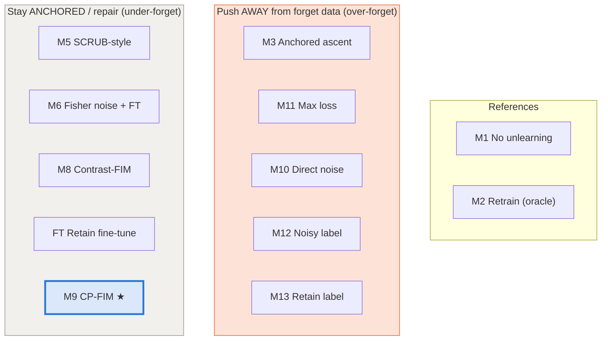
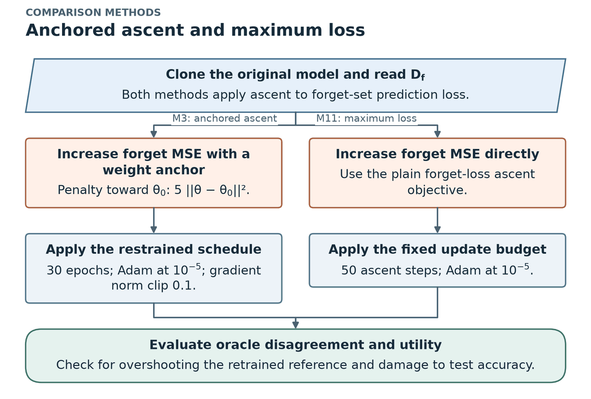
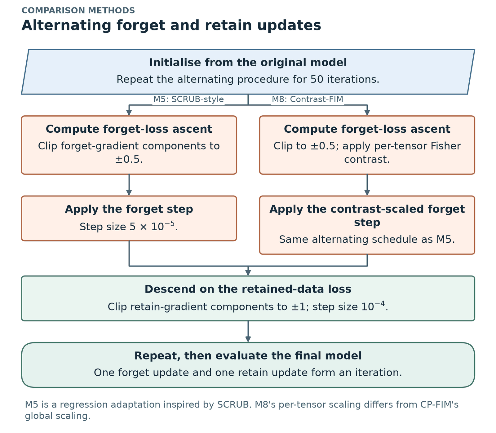
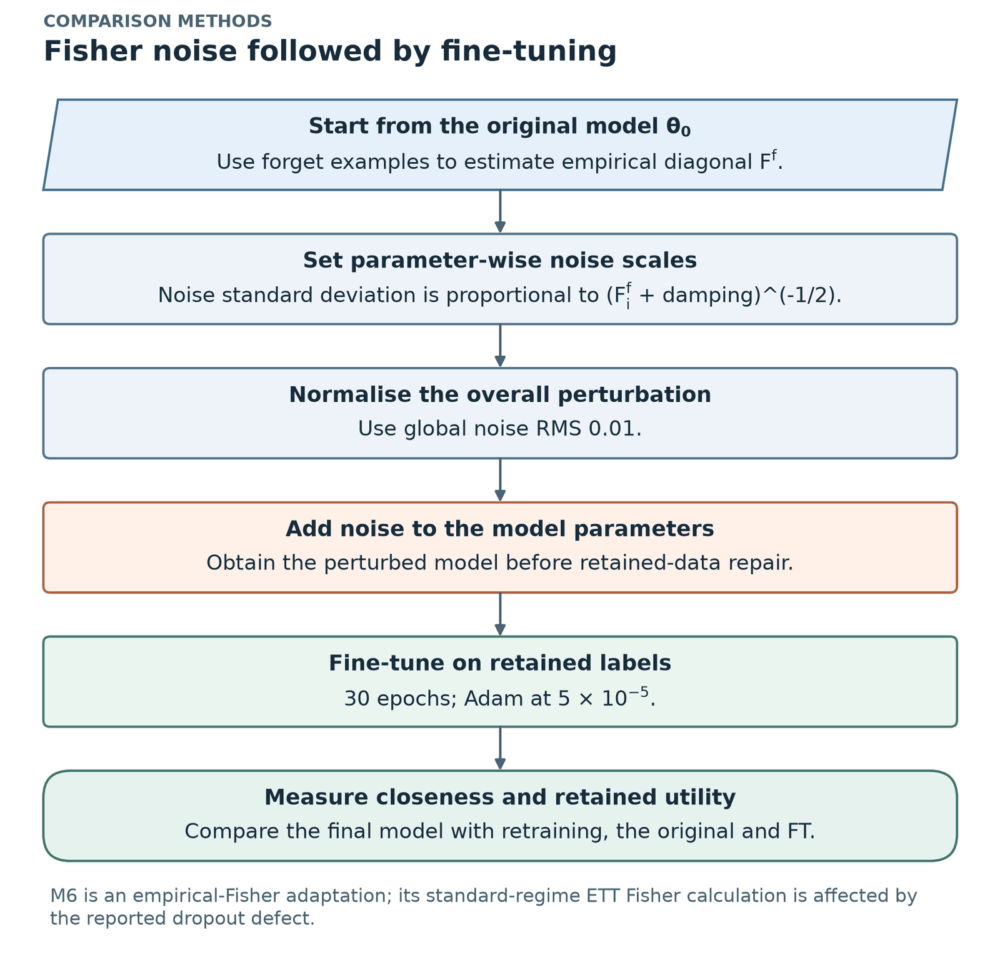
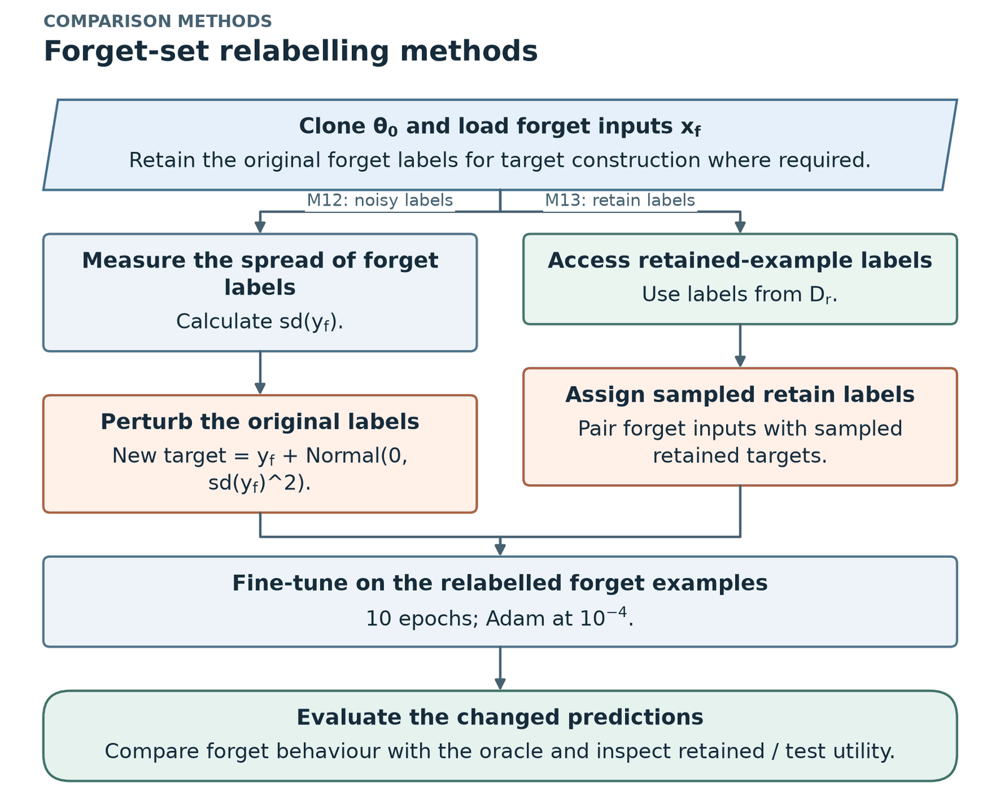
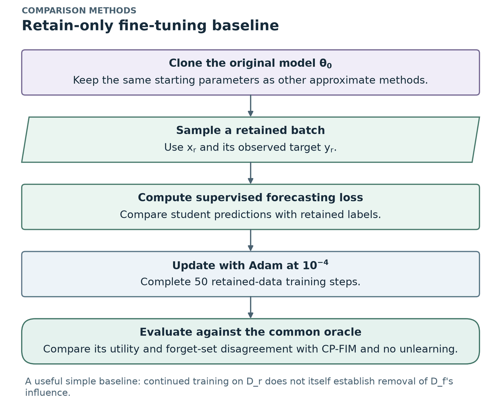
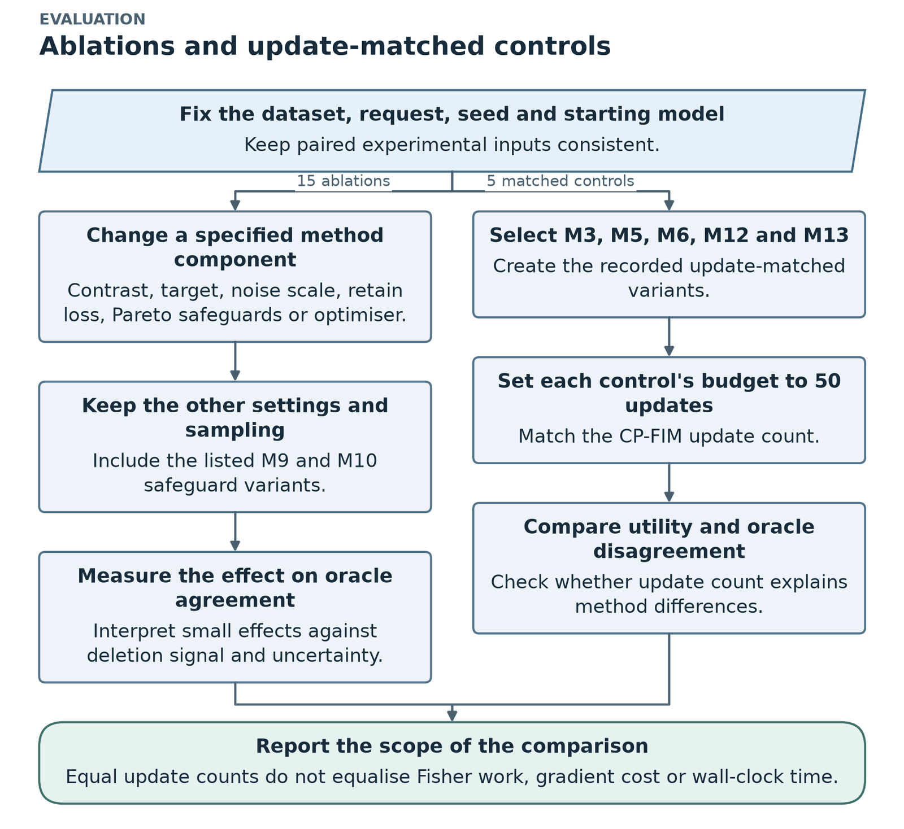

# 6. Comparison methods, design alternatives and ablations

*Thesis Sections 4.2 and 4.6. ← [CP-FIM](05_cpfim_method.md) · Next: [Evaluation metrics →](07_evaluation_metrics.md)*

---

## 6.1 The twelve methods (Table 4.16)

Methods marked *adaptation* follow the cited paper's idea but are **our own regression implementation**, not the authors' code.

| ID | Name | What it does | Family |
|---|---|---|---|
| **M1** | No unlearning | keeps the original model (**lower reference**) | reference |
| **M2** | Retraining (oracle) | trains from scratch on $D_r$ (**the target**) | reference |
| **M3** | Anchored gradient ascent | increases forget loss, with penalty $5\lVert\theta-\theta_0\rVert^2$ keeping weights near the original (Golatkar et al.) | aggressive |
| **M5** | SCRUB-style alternating | alternates an ascent step on forget data and a descent step on retain data (*adaptation* of Kurmanji et al.) | gentle |
| **M6** | Fisher noise + fine-tuning | adds noise shaped by the forget-set Fisher, then fine-tunes on retain data (*adaptation* of Golatkar et al.) | gentle |
| **M8** | Contrast-FIM | per-tensor Fisher contrast scaling an alternating ascent/descent update (the earlier version of our idea) | gentle |
| **M9** | **CP-FIM (proposed)** | Fisher-contrast-scaled, teacher-anchored, safeguarded Pareto teacher–student update | **proposed** |
| **M10** | Direct-noise adaptation | pushes forget predictions toward Gaussian noise with the same safeguards (*inspired by* TS-Unlearn) | aggressive |
| **M11** | Max loss | plain gradient ascent on the forget loss | aggressive |
| **M12** | Noisy label | fine-tunes on forget inputs with noisy targets (Graves et al.) | aggressive |
| **M13** | Retain label | fine-tunes on forget inputs with targets copied from retain examples | aggressive |
| **FT** | Retain fine-tuning | 50 steps of normal training on retain data only | gentle |

(The numbering skips M4 and M7. The final thesis does not list methods with those IDs.)

### How each method works

| Method pair | Mechanism | Risk |
|---|---|---|
| **M3 anchored ascent, M11 max loss** | Gradient **ascent** on forget-set MSE. M3 adds a squared-distance penalty to the original weights and a tighter clip. | Forget error overshoots the oracle; test performance can be destroyed (worst 12,866× for M3). |
| **M5 SCRUB-style, M8 Contrast-FIM** | Alternate: a clipped ascent step on a forget batch, then a clipped descent step on a retain batch (the "repair"). M8 scales the ascent by a **per-tensor** Fisher contrast. | Usually stable, but stays close to the original. |
| **M6 Fisher noise + FT, FT** | M6 adds parameter noise with s.d. ∝ (forget Fisher)^−½, then fine-tunes on retain labels. FT just keeps training on retain data. | Preserves utility, but may stay close to the original on the deleted examples. |
| **M9 CP-FIM, M10 direct noise** | Same loop; M9 targets *teacher + calibrated noise* with a Fisher contrast; M10 targets *zero-centred noise*, a different noise scale, and no contrast. | M10 over-forgets. M9 is stable but conservative. |
| **M12 noisy label, M13 retain label** | Supervised updates on forget inputs with altered targets: noisy original labels (M12) or labels sampled from retain examples (M13). | The change spreads to related retained and test windows. |

| Anchored and plain ascent (M3, M11) | Alternating updates (M5, M8) |
|---|---|
|  |  |
| **Fisher noise + fine-tuning (M6)** | **Relabelling (M12, M13)** |
|  |  |

### Settings as implemented (Table 4.17)

| Method | Settings |
|---|---|
| M3 Anchored ascent | 30 epochs over the forget set, Adam, LR $10^{-5}$, anchor weight 5, gradient-norm clip 0.1 |
| M5 SCRUB-style | 50 iterations; each = ascent step on a forget batch (step $5\times10^{-5}$, clip ±0.5) then descent step on a retain batch (step $10^{-4}$, clip ±1) |
| M6 Fisher noise + FT | noise s.d. ∝ $(F^f_i + \text{damping})^{-1/2}$, global RMS 0.01; then 30 epochs retain fine-tuning, Adam, $5\times10^{-5}$ |
| M8 Contrast-FIM | as M5, with the ascent step scaled by a per-tensor Fisher contrast |
| M10 Direct-noise | as CP-FIM, with the changes in Table 4.10 |
| M11 Max loss | 50 steps of gradient ascent on forget batches, Adam, $10^{-5}$ |
| M12 Noisy label | 10 epochs on forget inputs with targets $y + \mathcal{N}(0, \mathrm{sd}(y_f)^2)$, Adam, $10^{-4}$ |
| M13 Retain label | 10 epochs on forget inputs with targets sampled from retain examples, Adam, $10^{-4}$ |
| FT Retain fine-tuning | 50 steps on retain batches, Adam, $10^{-4}$ |

## 6.2 Design alternatives that were considered (Table 4.3)

Most alternatives were **kept as comparison methods or ablations**, so their behaviour was measured on exactly the same data, models and requests as CP-FIM.

| Alternative | Advantages | Disadvantages / evidence | Decision |
|---|---|---|---|
| **A.** Exact retraining (M2) | correct by definition; simple | full training cost per request (median 105 s here; days for big models) | used as the **reference** |
| **B.** Exact sharded training (SISA) | cheaper exact deletion | overlapping windows require isolating all dependencies; splitting can reduce accuracy | future comparison |
| **C.** Aggressive forgetting: ascent / max loss (M3, M11) | simple; large change on the forget set | **destructive**: test error ≥ 50% worse in 162 (M3) and 167 (M11) of 312 runs; worst 12,866× | rejected; kept as baselines |
| **D.** Relabelling (M12, M13) | very cheap | retain labels: test error ≥ 50% worse in 260 runs; noisy labels over-forget mildly | rejected; kept as baselines |
| **E.** Direct-noise target + Pareto, TS-Unlearn style (M10) | principled; balances two objectives | **over-forgets**: test ≥ 50% worse in 145 runs; median 12× farther from retraining than CP-FIM | rejected as design; **main comparison** |
| **F.** Contrast-scaled alternating updates (M8) | uses forget-vs-retain importance | per-tensor scaling can over-weight weak-contrast layers; behaviour conservative | comparison method |
| **G.** Plain (unconstrained) Pareto distillation | no manual weight | **stalls at step 1** (retain gradient = 0); RNNs did not move in **192/192** runs | safeguards added |
| **H.** **CP-FIM (M9)** | stable: test error **never > 10% worse**; closer to retraining than E in **56/56** | conservative: closer than doing nothing in only **22/56** | **selected** |

**Three families:**

1. **Exact** (A, B): correct, but expensive or broken by overlapping windows.
2. **Push away** (C, D, E): big change on the forget set, but they damage accuracy and end far from the oracle.
3. **Anchored** (F, G, H): safe, but they need safeguards to move at all.

### How the alternatives were verified (Table 4.4)

| Verification | What it checks | Where reported |
|---|---|---|
| Built-in self-tests | Fisher vs an analytic result, exact block sizes, non-finite rejection, checkpoint recovery | Implementation |
| Pipeline checks | split consistency, safe checkpoint recovery | Implementation |
| **Ablation grid (15)** | which CP-FIM parts matter | Results 5.2.4 |
| **Update-matched controls** | that differences are not caused by the number of updates | Results 5.4.2 |
| Unconstrained Pareto rule | the stall of alternative G | Table 5.12 |
| CPU parity check | the attention-dropout fix | Table 5.14 |
| Financial pilot | a scale-free target for finance | Table 5.15 |

## 6.3 The fifteen ablations (Table 4.18)

Each ablation changes **exactly one part** of CP-FIM (or of M10) and keeps everything else, **including the random sampling**.

| # | Ablation | Change compared with CP-FIM | Tests |
|---|---|---|---|
| 1 | No contrast | $C_i = 1$ for all parameters | does the Fisher contrast help? |
| 2 | Shuffled contrast | contrast values shuffled among parameters | is it the *specific* contrast? |
| 3 | Per-tensor normalisation | per-layer instead of global normalisation | global vs per-layer |
| 4 | Alternative Fisher normalisation | another normalisation of Fisher values | normalisation choice |
| 5 | No Pareto | fixed $\alpha = 0.5$ | does MGDA help? |
| 6 | Unconstrained | no floor/ceiling and no warm-up | the stall |
| 7 | Warm-up only | warm-up but no floor/ceiling | which safeguard matters |
| 8 | **Noise anchor** | forget target = **pure noise** instead of teacher + noise | **target anchoring** |
| 9 | **Ascent anchor** | forget objective = **gradient ascent** | target type |
| 10 | Supervised retain | retain loss uses true targets instead of the teacher | distillation vs supervision |
| 11, 12 | $\kappa = 0.5$, $\kappa = 2$ | smaller / larger noise | noise size |
| 13 | SGD | SGD instead of Adam (same LR) | optimiser |
| 14 | M10 unconstrained | direct noise without floor/ceiling/warm-up | stall in M10 |
| 15 | M10 warm-up only | direct noise with warm-up but no floor/ceiling | stall in M10 |

**Result (Finding 8):** most component changes move the result by **≤ about 2% of the gap**. The large effects come from replacing the **forget target**: pure noise → ≈ **3.7 gaps** away; gradient ascent → ≈ **583 gaps** away (ETT). See [Results](08_results.md#finding-8-which-parts-of-cp-fim-matter).

## 6.4 The five update-matched controls

Give **M3, M5, M6, M12 and M13 the same number of updates (50)** as CP-FIM, so the comparison is not just about update count.

> **Update-matched ≠ compute-matched.** The methods do different amounts of work per update (CP-FIM's Fisher step is expensive).

**Result:** with 50 updates each, CP-FIM is still closer than anchored ascent, noisy label and retain label in **56/56 settings** (311, 305 and 312 of 312 runs). These controls still damage accuracy (test error > 50% worse in 161, 74 and 302 runs). The update-matched SCRUB-style and Fisher controls behave like their originals: stable, and usually slightly closer than CP-FIM (CP-FIM closer in 17 and 20 of 56 settings).

