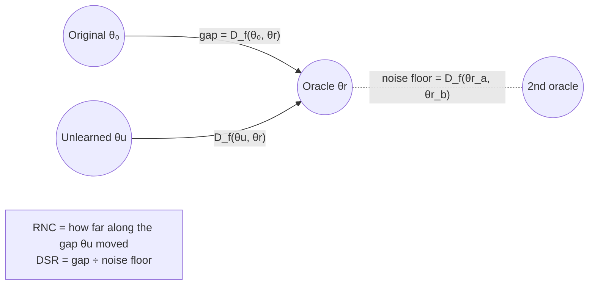

# 7. Evaluation metrics: how "unlearning worked?" is measured

*Thesis Sections 4.7 and 5.1.1–5.1.2. ← [Comparison methods](06_comparison_methods.md) · Next: [Results →](08_results.md)*

---


*Thesis Fig 5.1. After each unlearning run: forecast skill (vs persistence), retrain-referenced deletion measures (disagreement, DSR, RNC), an exploratory membership signal, utility stability and cost.*

## The three reference points

Every number in the results is read against:

| Reference | What it is | Role |
|---|---|---|
| **Oracle** $\theta_r$ | retrained on $D_r$ (seed + 7000) | **the target** |
| **Original** $\theta_0$ | doing nothing (M1) | **the lower reference** |
| **Retrain variation** | disagreement between two oracles with different seeds | **the natural noise floor** |

## 7.1 Prediction disagreement (the core measure)

For two models $a$, $b$ and a data split $X$ (forget, retain or test), with $m$ predicted values per example:

```math
\mathcal{D}_X(a, b) = \frac{1}{|X|}\sum_{x \in X} \frac{1}{m}\big\lVert f_a(x) - f_b(x) \big\rVert_2^2
```

- It compares **forecasts, not weights**: two networks can have very different weights and nearly the same forecasts.
- **Lower = closer to retraining.** "Distance to the retrained model" in the figures means $\mathcal{D}_f(\theta_u, \theta_r)$ on the forget set.
- **Retrain variation** = $\mathcal{D}_X(\theta_r^{(a)}, \theta_r^{(b)})$, two oracles with different seeds.

## 7.2 Deletion signal ratio (DSR): "is there anything to forget?"

```math
\mathrm{DSR} = \frac{\mathcal{D}_f(\theta_0, \theta_r)}{\mathcal{D}_f(\theta_r^{(a)}, \theta_r^{(b)})}
```

- **DSR ≈ 1**: deleting the data changes the model **no more than changing the random seed**. Any "unlearning improvement" is then hard to tell apart from noise.
- **DSR clearly > 1**: the deletion has a real effect that methods can try to reproduce.


*Thesis Fig 5.3.*

## 7.3 Retrain-normalised closeness (RNC): "how much of the gap did the method close?"

```math
\mathrm{RNC}(U) = \frac{\mathcal{D}_f(\theta_0, \theta_r) - \mathcal{D}_f(\theta_u, \theta_r)}{\mathcal{D}_f(\theta_0, \theta_r) - \mathcal{D}_f(\theta_r^{(a)}, \theta_r^{(b)})}
```

| RNC | Meaning |
|---|---|
| **0** | no better than doing nothing |
| **1** | as close to the oracle as another retrain |
| **< 0** | moved **away** from the oracle (over-forgetting) |

When the denominator is tiny (DSR near 1), RNC becomes unstable. That is why the main RNC table uses only the **43 settings with DSR ≥ 1.5**.


*Thesis Fig 5.12.*



## 7.4 Forecast error and forecasting skill

```math
\mathrm{MSE} = \frac{1}{Nm}\sum_{i=1}^{N}\lVert\hat y_i - y_i\rVert_2^2, \qquad
\mathrm{MAE} = \frac{1}{Nm}\sum|\hat y - y|, \qquad
\mathrm{RMSE} = \sqrt{\mathrm{MSE}}
```

These are computed separately on the **forget**, **retain** and **test** windows. MSE is the main scale.

> ⚠️ **Higher forget MSE alone does not mean better unlearning.** A model can be much worse than retraining on the deleted windows (over-forgetting).

**Persistence gate (forecast skill).** Persistence = "the next value equals the last value". The ratio $\mathrm{MSE}_{\text{model}} / \mathrm{MSE}_{\text{persistence}}$ is computed per asset in original units and then averaged. **Below 1 = the model beats the naive forecast.** This is a *prerequisite* for calling any unlearning result "useful forecasting preserved".


## 7.5 Utility stability (test-error ratio)

```math
\text{test-error ratio} = \frac{\mathrm{MSE}_{\text{test}}(\theta_u)}{\mathrm{MSE}_{\text{test}}(\theta_0)}
```

1 = unchanged; 1.10 = 10% worse. Over all **312 paired runs** per method, the thesis counts how often the ratio is **> 1.10, > 1.50 and > 2.00**, and reports the median, 95th percentile and worst case. **A method is called "stable" if its test error never rises by more than 10%.** (Objective O2.)


## 7.6 Paired wins

A **paired win** = method A has **lower forget-set disagreement with the same oracle** than method B, under the **same** dataset, architecture, regime, request and seed. Setting-level wins aggregate the paired runs (using the mean or median over runs). **A win does not by itself show that either method forgets successfully.** It is relative.

## 7.7 Loss-based membership attack (AUC), exploratory

- Score per window = **negative loss** (averaged over its forecast values). Low loss → "probably a training member".
- Forget windows vs **held-out non-member windows** (from the attack blocks), balanced within asset and calendar-year strata.
- **AUC** = probability that a random forget window scores higher than a random non-member window.

| AUC | Meaning |
|---|---|
| ≈ 0.5 | no separation *by this test* |
| ≫ 0.5 (e.g. 0.97) | forget windows clearly look like training data (memorised) |
| **< 0.5** | forget windows have **higher** loss than unseen data, so they stand out (the **Streisand effect**). This is **not** privacy. |

> The test is **weaker than LiRA**, is sensitive to sample difficulty, and **does not establish privacy or certified removal**.


## 7.8 Cost

Wall-clock seconds for the update; **speed-up = retraining time ÷ method time**. Equal update counts do **not** mean equal compute.

## 7.9 Statistics

- Seeds 42, 43, 44 (oracle = seed + 7000); ETT also has 3 requests.
- **Paired** comparisons (same seed and request).
- **Exploratory bootstrap intervals** that resample seeds and requests (cluster bootstrap).
- **Sign tests** for win counts, at several aggregation levels (runs, settings, datasets, architectures).
- Runs share original models, so they are **not fully independent**. Results are also reported at coarser levels.


## 7.10 Summary: questions, measures and good results (Table 5.1)

| Question | Measure | Good result |
|---|---|---|
| Is the base model useful? | test MSE / persistence MSE | **below 1** |
| Does the deletion matter? | DSR | **clearly above 1** |
| Is the method close to retraining? | disagreement with the oracle; RNC | low disagreement; **RNC near 1** |
| Is the method stable? | test MSE / original test MSE | **close to 1 in every run** |
| Does a membership test see the deleted data? | loss-attack AUC | **close to the oracle's AUC** |
| Is the method cheap? | speed-up over retraining | **clearly above 1** |

### All measures (Table 4.19)

| Measure | Meaning |
|---|---|
| Forget / retain / test MSE | forecast error on deleted, kept and future data |
| Disagreement $\mathcal{D}(\text{method}, \text{oracle})$ | mean squared forecast difference; lower = closer to retraining |
| Retrain variation | disagreement between two oracles (natural randomness) |
| DSR | deletion effect relative to a new seed |
| RNC | fraction of the original-to-oracle gap a method closes |
| Win count | settings/runs where CP-FIM is closer to the oracle than another method |
| Test-error ratio | test MSE after / original test MSE (stability) |
| Loss-attack AUC | how well a loss threshold separates forget from held-out windows (0.5 = none); exploratory |
| Relative MSE vs persistence | test MSE / "tomorrow equals today" MSE; > 1 = worse than naive |
| Time and speed-up | wall-clock time; retraining time ÷ method time |
