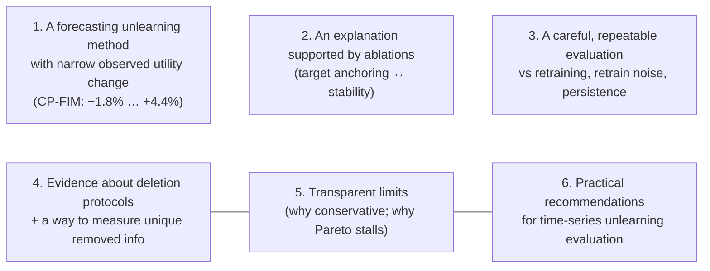
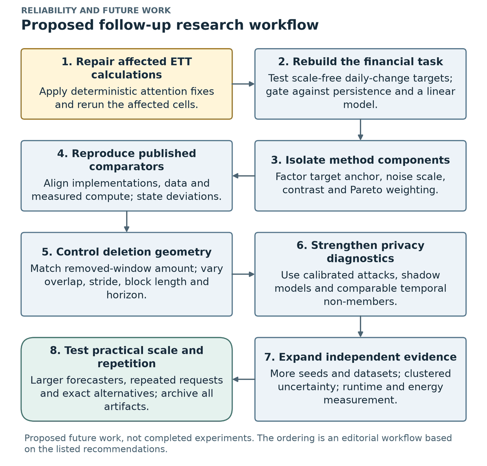

# 10. Conclusion, contributions, limitations, future work and impact

*Thesis Chapter 6 (Conclusion), Section 5.6 (Discussion) and Chapter 3 (Requirements, Impacts and Constraints). ← [Fixes and statistics](09_fixes_statistics_robustness.md) · Next: [Cheat sheet →](11_cheat_sheet.md)*

---

## 10.1 The nine main findings (Table 6.1)

| # | Finding |
|---|---|
| 1 | **CP-FIM is stable and beats the direct-noise approach.** Closer to retraining than the TS-Unlearn-inspired method in **56/56** settings (**310/312** runs; median **12×** closer), and closer than all five aggressive baselines in 56/56, also when they get the same update budget. |
| 2 | **CP-FIM has a narrow observed test-error range:** **−1.8% to +4.4%** in all 312 runs, while direct noise makes it ≥ 50% worse in 145 runs. It holds in all **44** settings unaffected by the defect. |
| 3 | **Target anchoring is associated with stability.** Removing the teacher anchor changes the result much more than changing the Fisher contrast or Pareto settings. |
| 4 | **CP-FIM is conservative.** Closer than doing nothing in only **22/56**; retain fine-tuning is usually closer. The same anchoring that makes it stable keeps it near the original. |
| 5 | **How data is deleted decides what can be measured.** Random window deletion removes almost no unique information; block and time-stamp deletion remove much more. |
| 6 | **Measures disagree.** Prediction agreement can see effects that a loss-based membership test cannot. |
| 7 | **Pareto-weighted distillation can stall.** CP-FIM- and TS-Unlearn-type updates stop at the original model unless the weight is safeguarded (the retain gradient is zero at the start). |
| 8 | **Financial price-level models are weak.** Much worse than persistence; predicting scale-free daily changes reaches about persistence level in a limited pilot. |
| 9 | **Retraining is cheap for small forecasters.** Seconds to minutes; often the best practical choice at this model size. |

## 10.2 Contributions to the field

## 10.3 What it means in practice (six recommendations)

1. **Define the deletion unit clearly.** If someone asks to delete an observation, remove **every window** that uses it.
2. **Always compare with retraining**, and with the natural variation between retrained models, not only with the original model.
3. **Do not judge unlearning by how *large* the forget error becomes.** A very wrong model is easy to detect and often damages accuracy.
4. If an approximate method is used, **consider a teacher-anchored objective and clipped updates**, as in CP-FIM, and **verify utility empirically**.
5. **Check forecasting models against a naive baseline** before interpreting any unlearning result.
6. **For small forecasters, retraining is often cheap enough** and gives the direct reference (though it is not a privacy certificate).

## 10.4 Limitations (stated as scope)

| Limitation | What it means | Mitigation / where addressed |
|---|---|---|
| **Stability ≠ successful removal** | CP-FIM beats no-op in 22/56 and FT in 15/56; the high-capacity loss signal stays near the original | reported openly; future: oracle-informed targets |
| **Attention-dropout defect** | 12 standard-ETT settings (≈ 2,160 records) affected | reported separately; main result is 44/44 in unaffected settings |
| **Financial forecasting validity** | all financial price-level models lose to persistence | finance treated as descriptive; daily-change pilot |
| **Comparator fidelity** | M5, M6, M10 are adaptations, not the authors' code | named as adaptations; future: faithful reproductions |
| **Deletion geometry** | time-stamp deletion removes more windows than block, so shape and amount are not fully isolated | future: match removed amounts |
| **Limited attack** | loss-AUC is exploratory; no LiRA / shadow models | future: stronger attacks |
| **Statistical independence** | 3 seeds; shared models; related datasets | coarser-level reporting; nominal tails |
| **Scope and cost** | the regimes change 5 settings together; update-matched ≠ compute-matched; small models | stated |
| **Data** | survivorship bias in the 20-stock list; adjusted prices can change between downloads | stated; future: frozen versions |
| **Reproducibility boundary** | recomputing every prediction-based measure needs the saved prediction arrays | archive arrays, data versions, seeds |

## 10.5 Recommendations for future work

1. **Re-run the standard-regime ETT settings with corrected gradients** (dropout off, one attention path) to confirm the 12 affected settings.
2. **Rebuild the financial task first**: the scale-free daily-change target across all datasets, architectures and seeds, with persistence and linear gates; frozen data versions; assets chosen without today's large-cap filter.
3. **Design for movement toward the oracle**: forget targets informed by retained-data predictions; factorial ablations of anchor × noise × contrast × Pareto.
4. **Faithful published-method comparisons**: original TS-Unlearn, SCRUB and Fisher-noise code; aligned budgets; measured compute.
5. **Control deletion amount and overlap**: match the removed-window counts; vary block length, stride and horizon.
6. **Stronger privacy evaluation**: LiRA, forecasting-specific attacks, shadow models, time-comparable non-members.
7. **More statistical and computational evidence**: more seeds, unrelated datasets, cluster-level uncertainty, end-to-end energy, compute-matched budgets.
8. **Settings where approximate unlearning has a real role**: larger forecasters, longer horizons, repeated requests, compared with time-aware sharding (SISA-like).

## 10.6 Final conclusion (thesis Section 6.5, paraphrased)

To forecast-unlearn properly you need **well-defined deletion units**, **useful base models** and **multiple evaluation signals**. Random overlapping-window deletion may produce little measurable change; stronger block and time-stamp requests reveal a **stability–forgetting trade-off**. Across the recorded settings, CP-FIM is closer to retraining than the direct-noise adaptation, but it usually stays close to the original model.

---

## 10.7 Requirements, impacts and constraints (thesis Chapter 3)

### Final specifications and requirements

- Load and validate 8 datasets; keep chronological order; disjoint train/val/test.
- Scale only on an early public prefix; apply dependency closure for time-stamp requests.
- Train original and retained-data reference models; apply all methods under shared dataset, request and seed settings.
- Record forecast errors, disagreement with the oracle, skill vs persistence, the membership signal and runtime.
- Save predictions, weights, traces and result tables; fixed seeds, data hashes, code fingerprints; resumable checkpoints; built-in self-tests.
- **Stack:** Python 3.11, PyTorch 2.11 + CUDA 12.8, NumPy, pandas, scikit-learn, Matplotlib, Jupyter, on an **RTX 4070 Ti SUPER (16 GB)**.
- **Compute:** ≈ 74 GPU-hours = **9.6 h** original models + **17.6 h** retrained references + **47.2 h** unlearning methods.

### Societal impact

- **Positive:** helps organisations explain what their removal process actually covers; retraining comparisons and transparent error reporting build trust in forecasting services (energy, finance).
- **Risk:** a weak diagnostic can create a **false sense of safety** if presented as proof that data is gone. Our AUC test is exploratory. The financial price-level models perform worse than persistence and **must not** be used for trading or investment.

### Environmental impact (Table 3.1)

| Activity | GPU-hours | Energy (kWh) | CO₂ (kg) |
|---|---:|---:|---:|
| Recorded experiment | 74 | ≈ 30 | ≈ 18–21 |

Assumes ≈ 0.4 kW for the whole computer under load and ≈ 0.6–0.7 kg CO₂/kWh (estimates, not measurements). Small compared with LLM training. The findings can **reduce** future energy use: retraining these models takes only about 0.5–5.5 minutes, and the pipeline caches and resumes so no work is repeated.

### Ethical issues

- Public market and sensor data only; no personal records collected.
- Empirical measurements are clearly separated from legal or cryptographic guarantees.
- Cases where CP-FIM stays near the original are reported; known defects are disclosed.
- Survivorship bias is acknowledged; finance predictions are not offered as trading advice.
- Published methods are credited; local implementations are labelled as adaptations.

### Standards

- **Data protection:** GDPR Article 17 (right to erasure) is the legal motivation. The experiments do **not** establish legal compliance.
- **Software practice:** version-controlled notebooks, fixed seeds, recorded versions and data hashes, automatic correctness tests.
- **Evaluation practice:** time-ordered splits with purged boundaries (Cerqueira et al.); naive-baseline comparison (Zeng et al.).

### Risk management (Table 3.2)

| Risk | Level | Mitigation |
|---|---|---|
| Long runs interrupted (power cut, crash) | High | atomic checkpoints with backup; resume without retraining finished parts |
| Data leakage giving false results | High | public-prefix scaler; calendar splits; purged boundaries; automatic split checks |
| A closely related paper appears (TS-Unlearn) | Medium | re-framed to test a different question (indistinguishability, deletion protocols) |
| Software bugs | Medium | self-tests; bug log; remaining known issue disclosed |
| Not enough GPU time | Medium | batch benchmark, GPU caching, prioritised experiment order |
| Weak or negative results | Medium | an evaluation study that does not depend on one method winning |

### Economic analysis (Table 3.3)

| Item | Approximate cost |
|---|---|
| Electricity ≈ 30 kWh (BDT 8–12 / kWh) | ≈ BDT 240–360 |
| Equivalent cloud GPU (≈ 74 h at USD 0.5–1.0 / h) | ≈ USD 37–74 |
| Software | free (open source) |
| Data | free (public sources) |

**Economic lesson:** for forecasters of this size, exact retraining costs seconds to minutes (median **27–30 s** standard, **110–326 s** high-capacity), so it is both cheaper to build and more reliable than an approximate method that only partly imitates it.
