# 13. Figure atlas: every figure in this repository

*← [Viva Q&A](12_viva_questions.md) · [Back to README](../README.md)*

Click any thumbnail to open the full-size image. "Used in" links to the guide chapter that explains the figure.

| Folder | Count | What it holds |
|---|---:|---|
| `figures/thesis/methodology` | 11 | Methodology diagrams exactly as used in the final thesis |
| `figures/thesis/results` | 12 | Result figures exactly as used in the final thesis |
| `figures/tikz` | 4 | Diagrams drawn in LaTeX/TikZ inside the thesis, rendered to PNG |
| `figures/flowcharts` | 38 | Additional flowcharts from the team's 48-figure library (the other 10 are the thesis versions above) |
| `figures/summary` | 10 | New summary charts made for this guide from the thesis tables |
| **Total** | **75** | |

---

## A. Thesis methodology figures (11)

| Preview | Thesis no. | Caption | Used in |
|---|---|---|---|
|  | Fig 1.3 | Methodology in brief: the ten-stage research workflow. | [01](01_big_picture.md) |
|  | Fig 1.1 | Exact and approximate unlearning. | [01](01_big_picture.md) |
| <a href="../figures/thesis/methodology/14_original_oracle_student.png">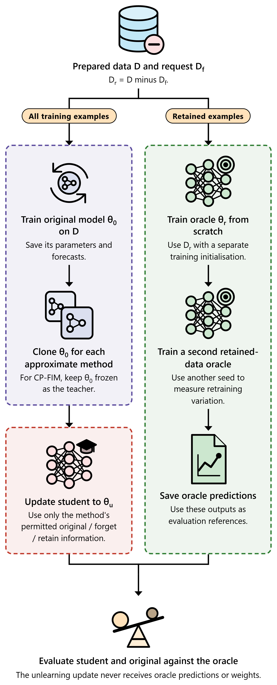</a> | Fig 4.1 | Model roles in the experiment (original, oracle, student). | [05](05_cpfim_method.md) |
|  | Fig 4.3 | The dependency span of a sliding-window example. | [01](01_big_picture.md) |
| <a href="../figures/thesis/methodology/25_teacher_student_loss_branches.png">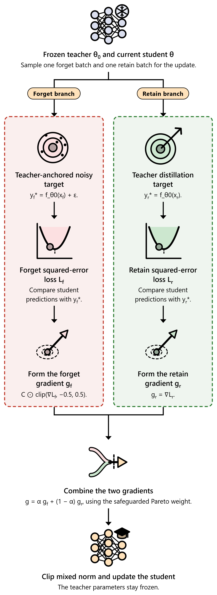</a> | Fig 4.4 | The CP-FIM teacher-student structure. | [05](05_cpfim_method.md) |
| <a href="../figures/thesis/methodology/21_cpfim_complete_algorithm.png">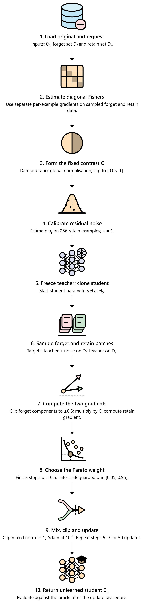</a> | Fig 4.6 | CP-FIM setup and iterative update procedure. | [05](05_cpfim_method.md) |
| <a href="../figures/thesis/methodology/13_dependency_closure_decision_icons.png">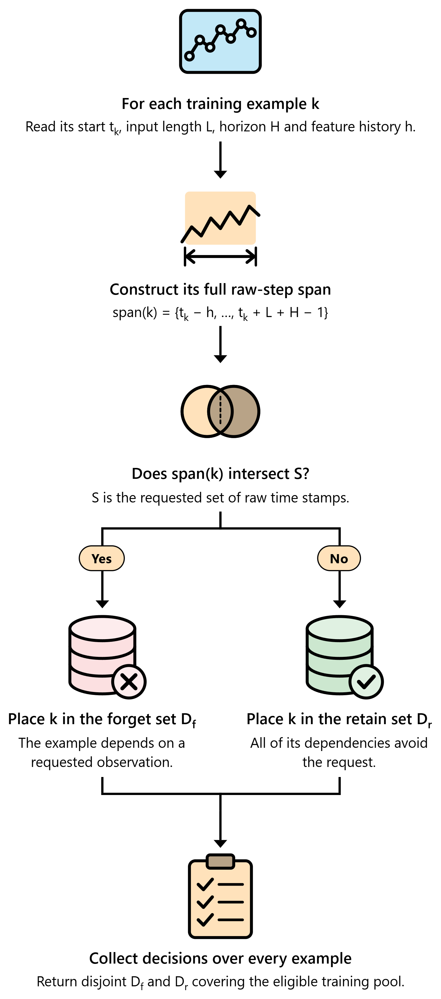</a> | Fig 4.9 | The per-window dependency-closure decision. | [03](03_data_and_deletion.md) |
|  | Fig 4.10 | Experimental pipeline for every configuration and seed. | [04](04_models_and_training.md) |
| <a href="../figures/thesis/methodology/35_evaluation_pipeline.png">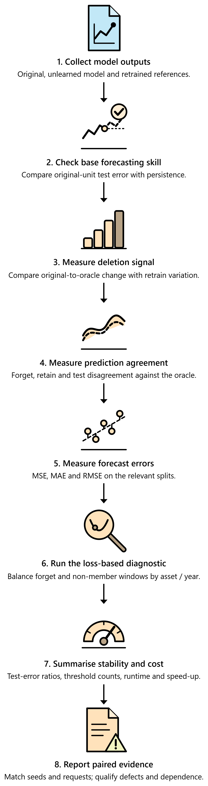</a> | Fig 5.1 | The evaluation pipeline after unlearning. | [07](07_evaluation_metrics.md) |
| <a href="../figures/thesis/methodology/37_deletion_signal_ratio.png">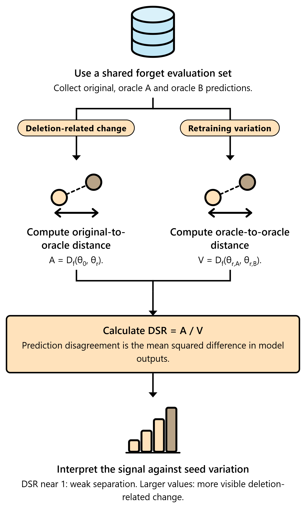</a> | Fig 5.3 | Computing the deletion signal ratio (DSR). | [07](07_evaluation_metrics.md) |
| <a href="../figures/thesis/methodology/38_retrain_normalised_closeness.png">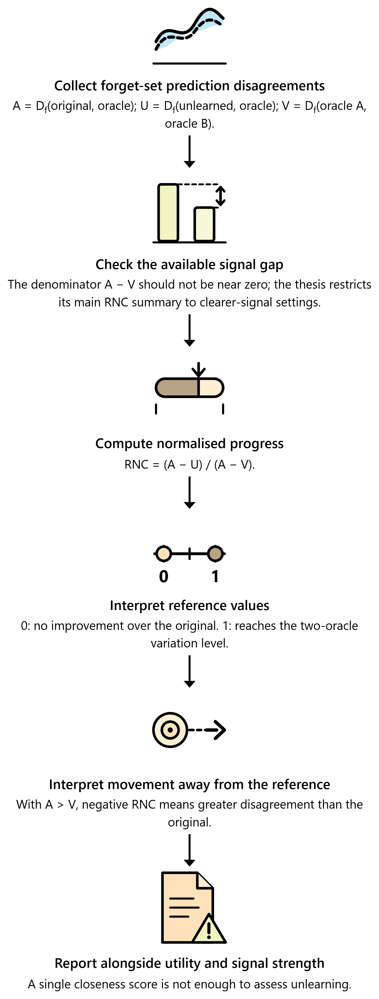</a> | Fig 5.12 | Computing retrain-normalised closeness (RNC). | [07](07_evaluation_metrics.md) |

---

## B. Thesis result figures (12)

| Preview | Thesis no. | Caption | Used in |
|---|---|---|---|
| <a href="../figures/thesis/results/ett_deletion_protocols.png">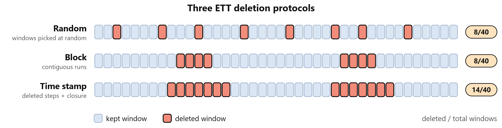</a> | Fig 4.8 | The three ETT deletion protocols (random, block, time stamp). | [03](03_data_and_deletion.md) |
| <a href="../figures/thesis/results/fig6_validity_gate.png">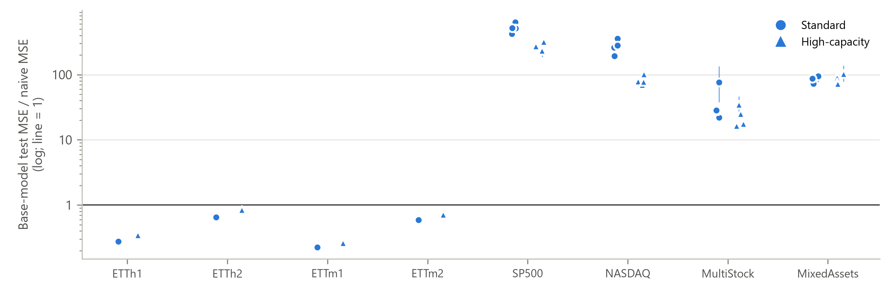</a> | Fig 5.2 | Forecasting skill of the original models vs persistence (log scale). | [08](08_results.md) |
| <a href="../figures/thesis/results/fig1_deletion_signal_by_protocol.png">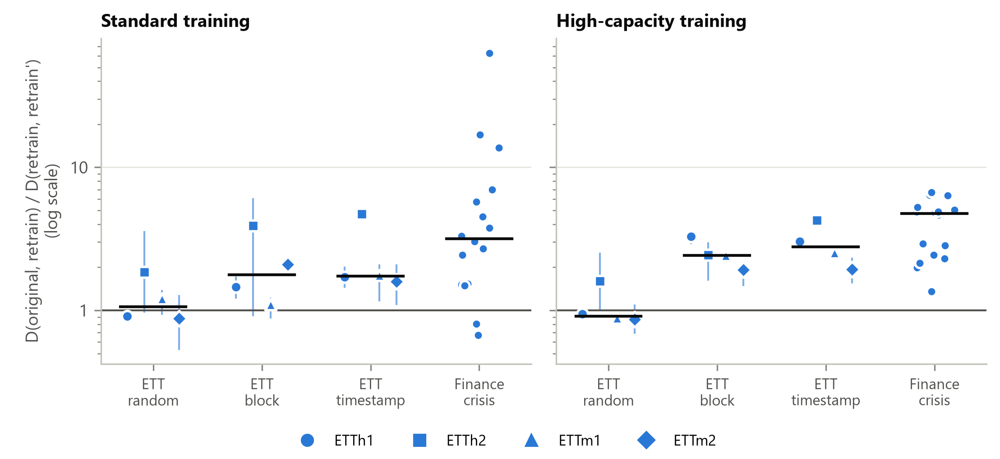</a> | Fig 5.4 | Deletion signal ratio by protocol. | [08](08_results.md) |
|  | Fig 5.5 | Deletion signal vs share of raw data losing all support. | [08](08_results.md) |
| <a href="../figures/thesis/results/fig2_loss_attack_auc_ett_memorize.png">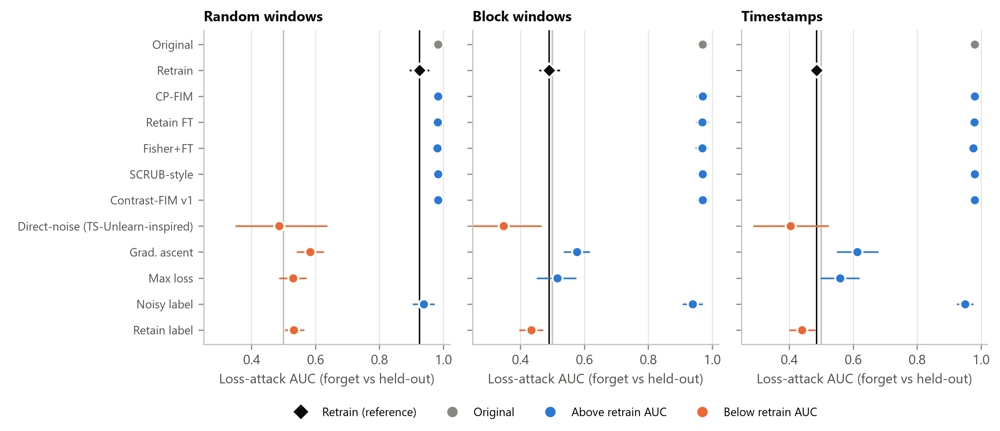</a> | Fig 5.6 | Loss-attack AUC, ETT high-capacity, with bootstrap intervals. | [08](08_results.md) |
| <a href="../figures/thesis/results/fig3_error_ratios_vs_retrain_ett.png">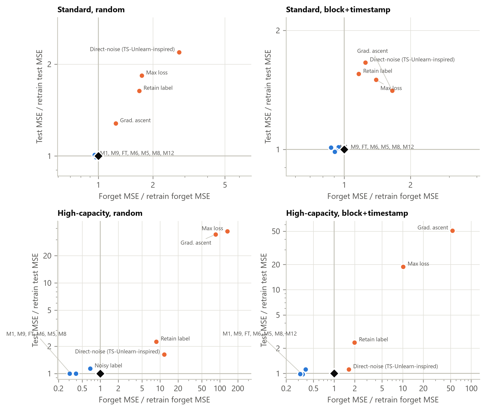</a> | Fig 5.7 | Forget-set and test errors relative to retraining. | [08](08_results.md) |
|  | Fig 5.8 | Every run of every method: test MSE relative to the original. | [08](08_results.md) |
|  | Fig 5.9 | Main result: CP-FIM vs direct noise, every paired run (310/312). | [08](08_results.md) |
| <a href="../figures/thesis/results/fig11_ratio_by_dataset.png">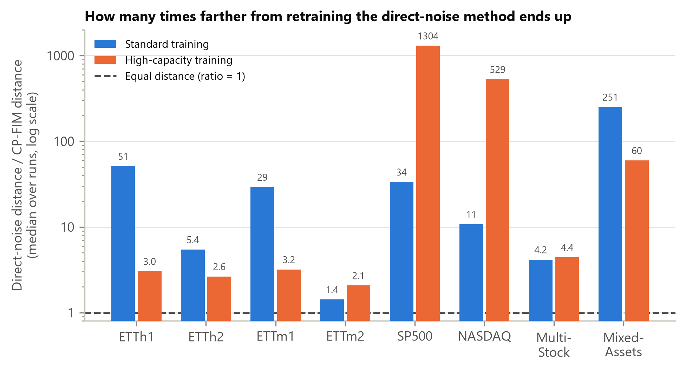</a> | Fig 5.10 | How many times farther direct noise ends up, by dataset and regime. | [08](08_results.md) |
|  | Fig 5.11 | Trade-off map: closeness to retraining vs test error. | [08](08_results.md) |
| <a href="../figures/thesis/results/fig4_cpfim_ablations.png">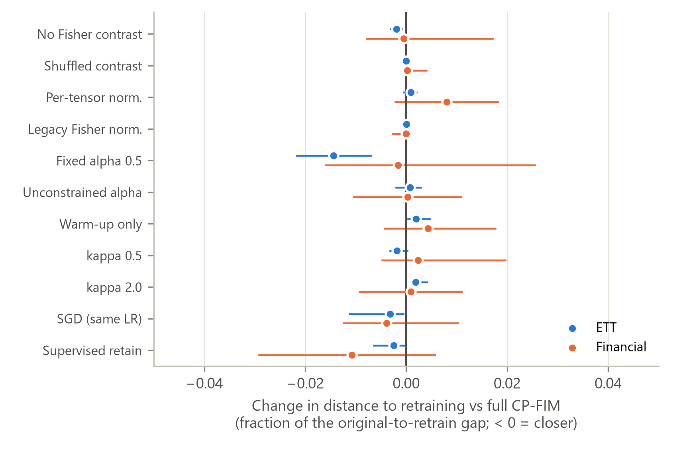</a> | Fig 5.13 | Effect of each CP-FIM component (ablations). | [08](08_results.md) |
| <a href="../figures/thesis/results/fig5_pareto_fixed_point.png">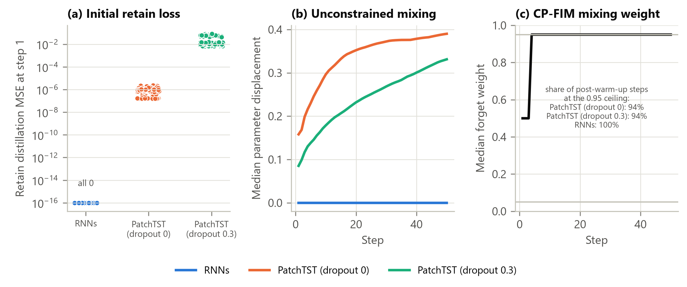</a> | Fig 5.14 | Pareto stall: retain loss, displacement, CP-FIM forget weight. | [09](09_fixes_statistics_robustness.md) |

---

## C. TikZ figures from the thesis source (4)

| Preview | Thesis no. | Caption | Used in |
|---|---|---|---|
|  | Fig 1.2 | Three outcomes: under-forgetting, match, over-forgetting. | [01](01_big_picture.md) |
| <a href="../figures/tikz/design_process.png">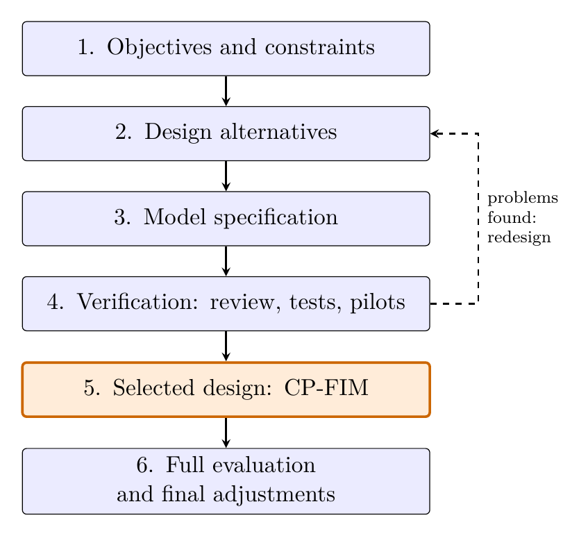</a> | Fig 4.2 | The design process of this thesis. | [05](05_cpfim_method.md) |
| <a href="../figures/tikz/mgda_pareto_geometry.png">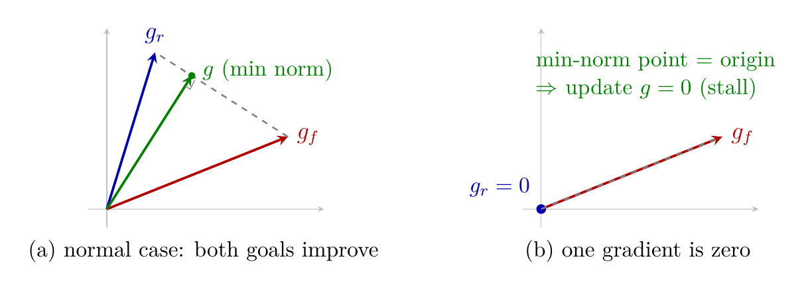</a> | Fig 4.5 | Geometry of the MGDA (Pareto) weight and the stall case. | [05](05_cpfim_method.md) |
| <a href="../figures/tikz/leakage_control_timeline.png">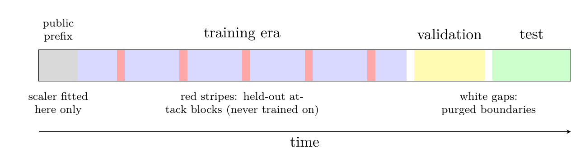</a> | Fig 4.7 | Leakage control: public prefix, splits, purged gaps, attack blocks. | [03](03_data_and_deletion.md) |

---

## D. Flowchart library (38)

These come from the team's standalone flowchart library (48 source-based diagrams). Ten of them are in the thesis and appear in section A in their final edited form; the other 38 are here. Importance (★★★ essential, ★★ recommended, ★ optional) is the library's own rating.

### Overview

| Preview | Title | Caption | Used in |
|---|---|---|---|
|  | ★★ From research questions to evidence | Evaluation sequence connecting deletion geometry, measurement choice, method comparison, stability, simple baselines and forecasting validity. | [01](01_big_picture.md) |

### Data and deletion

| Preview | Title | Caption | Used in |
|---|---|---|---|
| <a href="../figures/flowcharts/04_financial_data_preparation.png">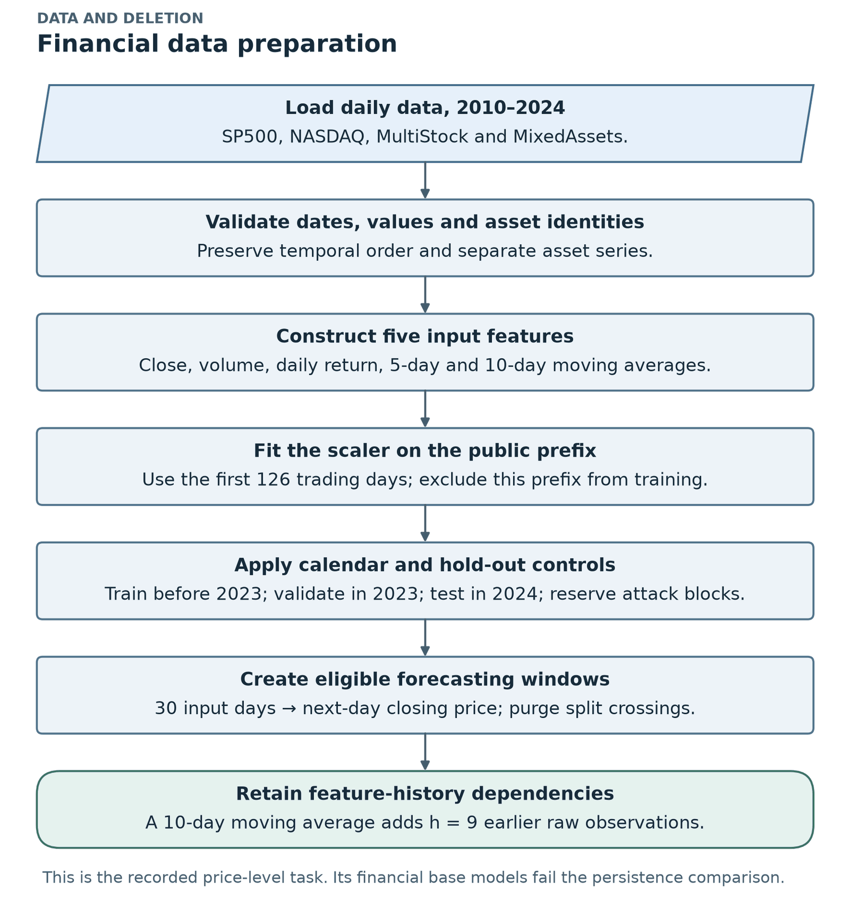</a> | ★★ Financial data preparation | Preparation of daily financial examples using an early public scaling prefix, time-ordered splits and 30-day input windows. | [03](03_data_and_deletion.md) |
| <a href="../figures/flowcharts/05_ett_data_preparation.png">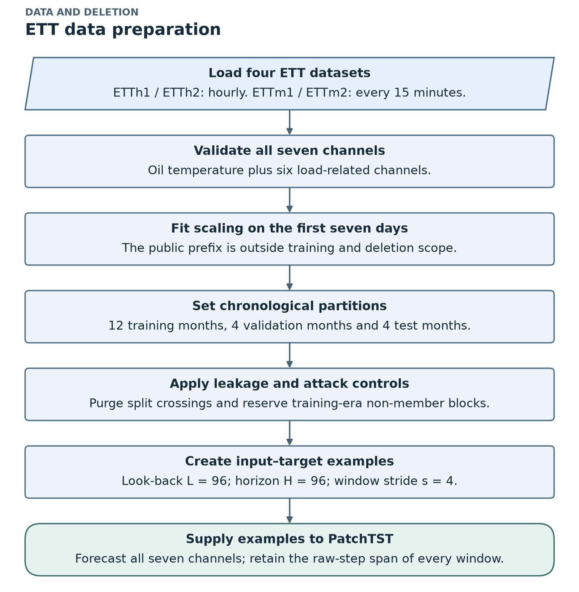</a> | ★★ ETT data preparation | Preparation of the four ETT series with seven channels, public-prefix scaling and overlapping 96-to-96 forecasting windows. | [03](03_data_and_deletion.md) |
| <a href="../figures/flowcharts/06_temporal_leakage_controls.png">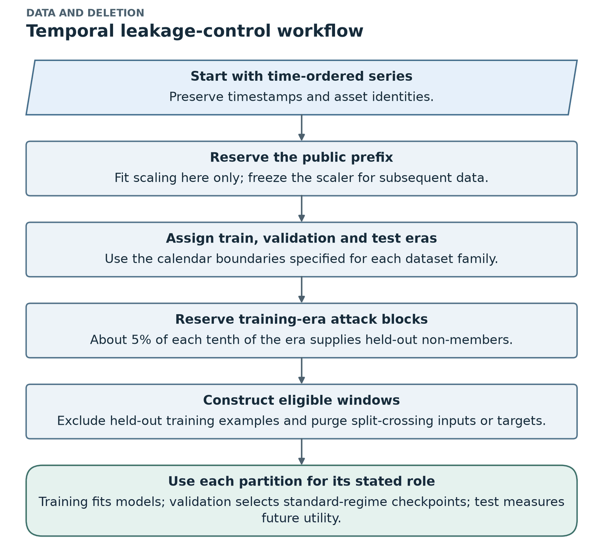</a> | ★★ Temporal leakage-control workflow | Leakage controls keep public scaling, chronological evaluation partitions and held-out attack examples separate from the training data. | [03](03_data_and_deletion.md) |
| <a href="../figures/flowcharts/08_deletion_request_routing.png">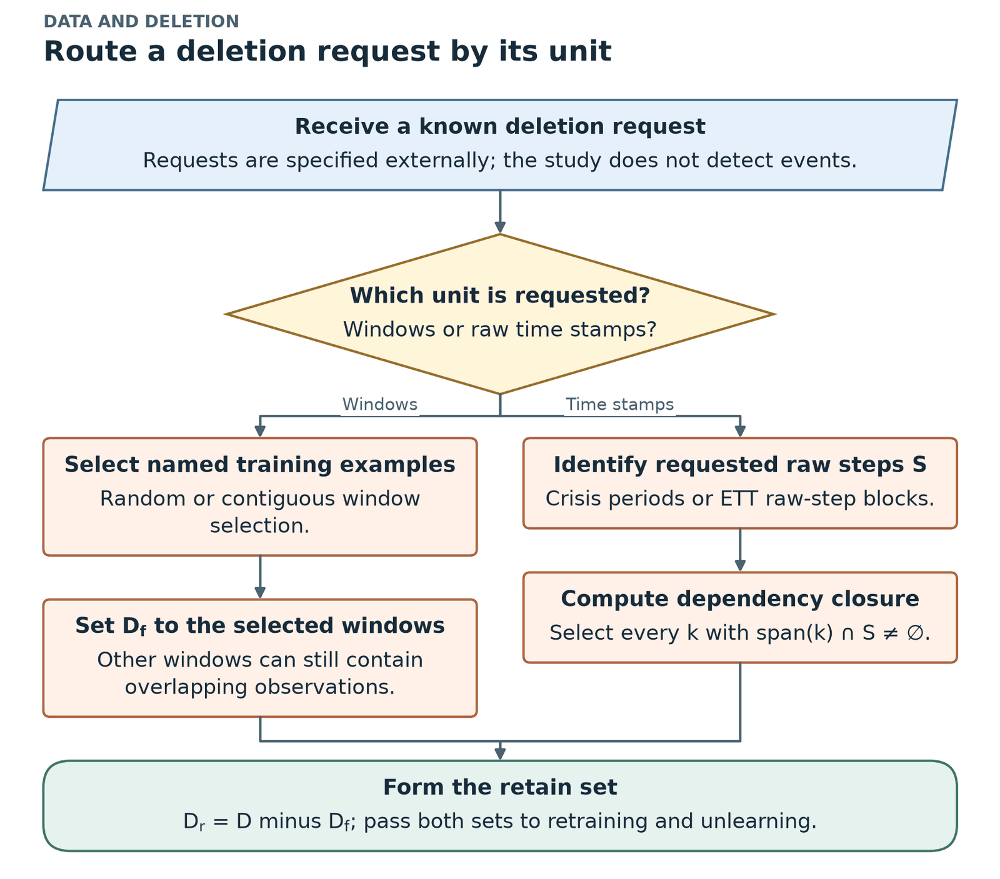</a> | ★★ Route a deletion request by its unit | Window requests directly select examples; time-stamp requests first expand to all dependent examples before forming the retain set. | [03](03_data_and_deletion.md) |
| <a href="../figures/flowcharts/09_financial_crisis_request.png">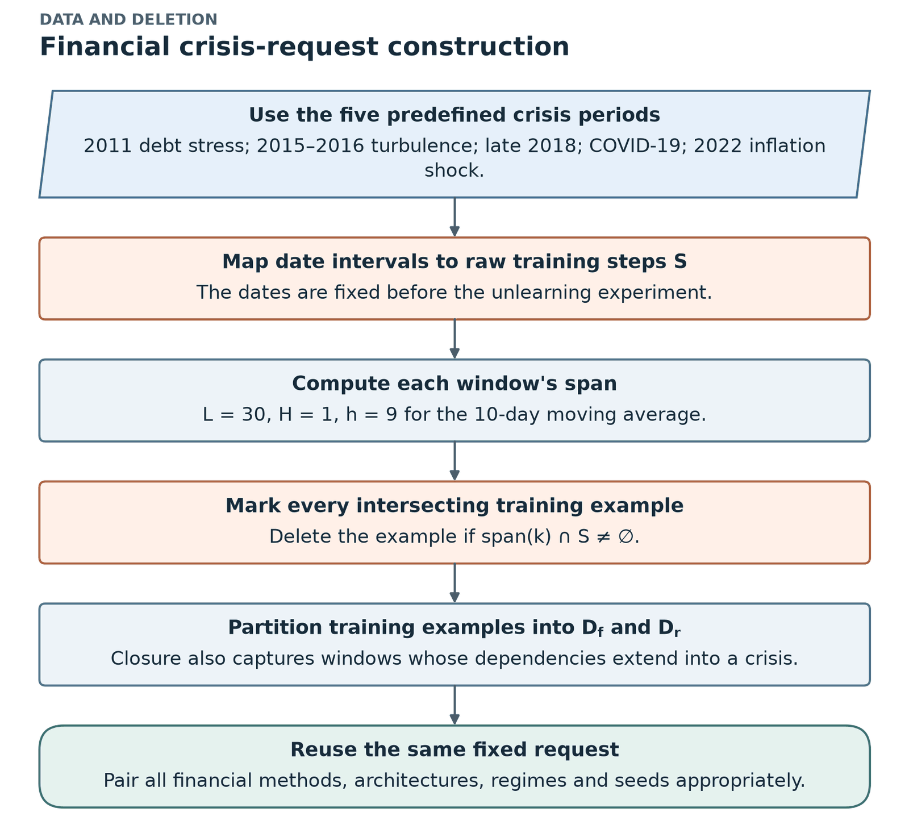</a> | ★★ Financial crisis-request construction | The fixed financial request combines five specified crisis periods and removes every training window whose full dependency span intersects them. | [03](03_data_and_deletion.md) |
| <a href="../figures/flowcharts/10_random_window_deletion.png">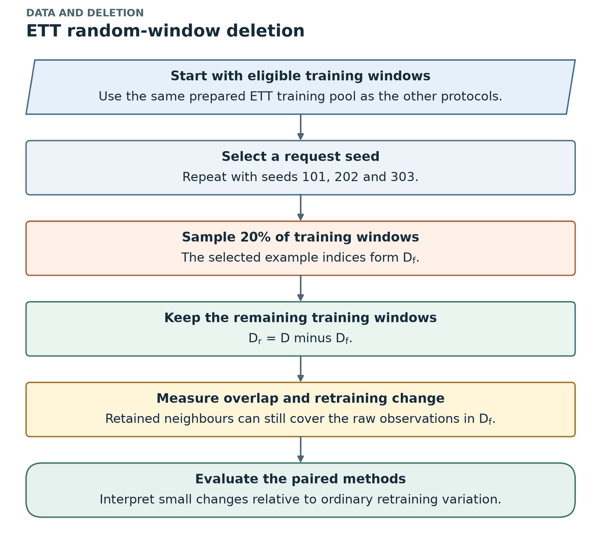</a> | ★ ETT random-window deletion | Random-window deletion samples 20% of eligible ETT training windows, with three request seeds and substantial remaining overlap among retained neighbours. | [03](03_data_and_deletion.md) |
| <a href="../figures/flowcharts/11_block_window_deletion.png">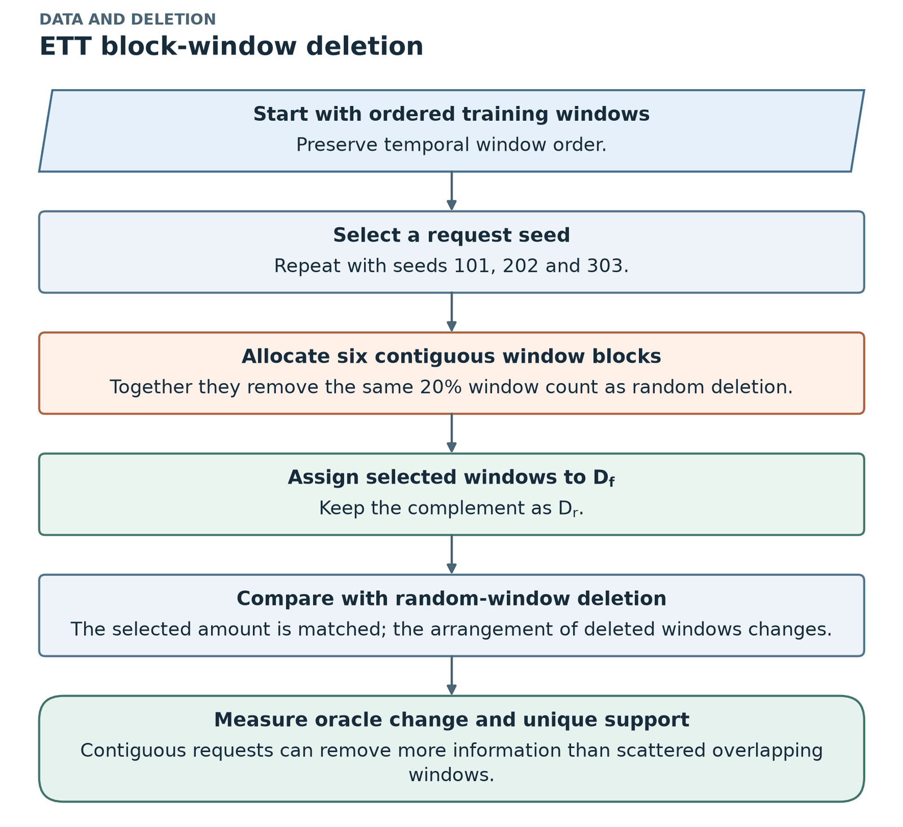</a> | ★ ETT block-window deletion | Block-window deletion removes 20% of eligible training windows in six contiguous blocks, matching the random protocol's deletion count. | [03](03_data_and_deletion.md) |
| <a href="../figures/flowcharts/12_timestamp_deletion.png">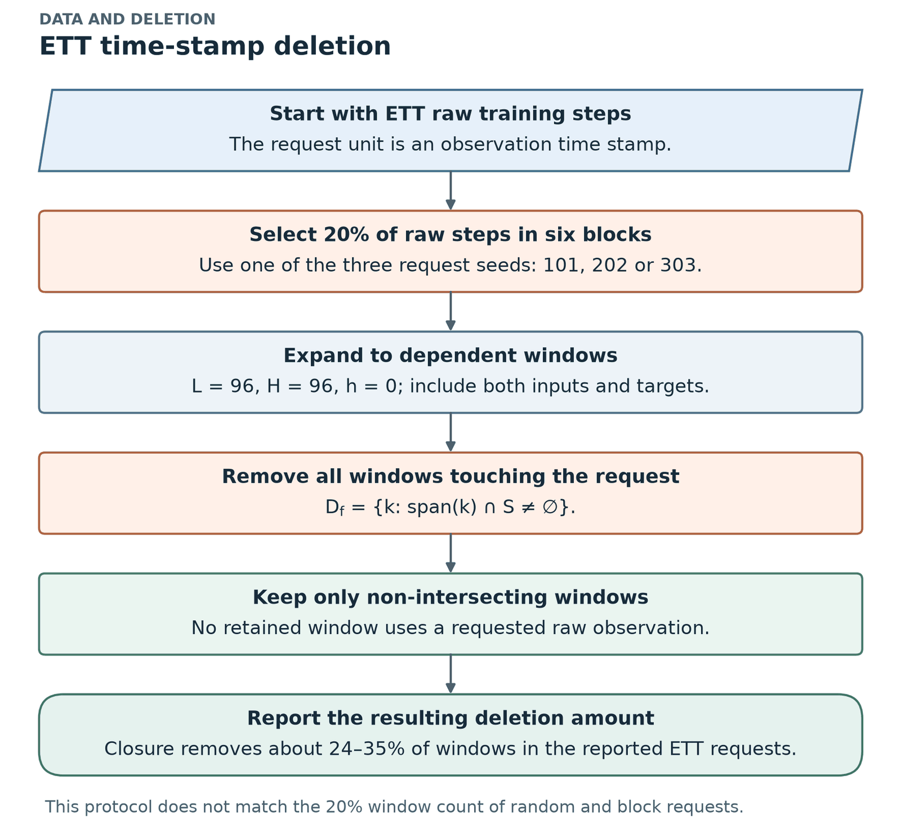</a> | ★ ETT time-stamp deletion | Time-stamp deletion selects raw observations first and then removes their dependent forecasting windows, increasing the deleted-window fraction through closure. | [03](03_data_and_deletion.md) |

### Forecasting models

| Preview | Title | Caption | Used in |
|---|---|---|---|
|  | ★★ Two forecasting training regimes | Standard and high-capacity training share the training framework but change width, regularisation, duration and checkpoint selection together. | [04](04_models_and_training.md) |
|  | ★ LSTM forecasting architecture | The implemented financial LSTM maps a 30-day, five-feature history to a next-day closing-price prediction. | [04](04_models_and_training.md) |
|  | ★ GRU forecasting architecture | The implemented GRU uses three gated recurrent layers and the common financial forecasting head. | [04](04_models_and_training.md) |
|  | ★ Bidirectional LSTM forecasting | The BiLSTM reads the observed input window in both directions, concatenates the representations and predicts one next-day value. | [04](04_models_and_training.md) |
|  | ★ CNN-LSTM forecasting architecture | The CNN-LSTM extracts local temporal features with two convolutions before recurrent modelling and next-day price prediction. | [04](04_models_and_training.md) |
|  | ★★ PatchTST forecasting architecture | The implemented PatchTST processes each ETT channel through normalisation, patch embedding and a shared channel-independent Transformer pipeline. | [04](04_models_and_training.md) |

### CP-FIM

| Preview | Title | Caption | Used in |
|---|---|---|---|
| <a href="../figures/flowcharts/22_empirical_fisher_estimation.png">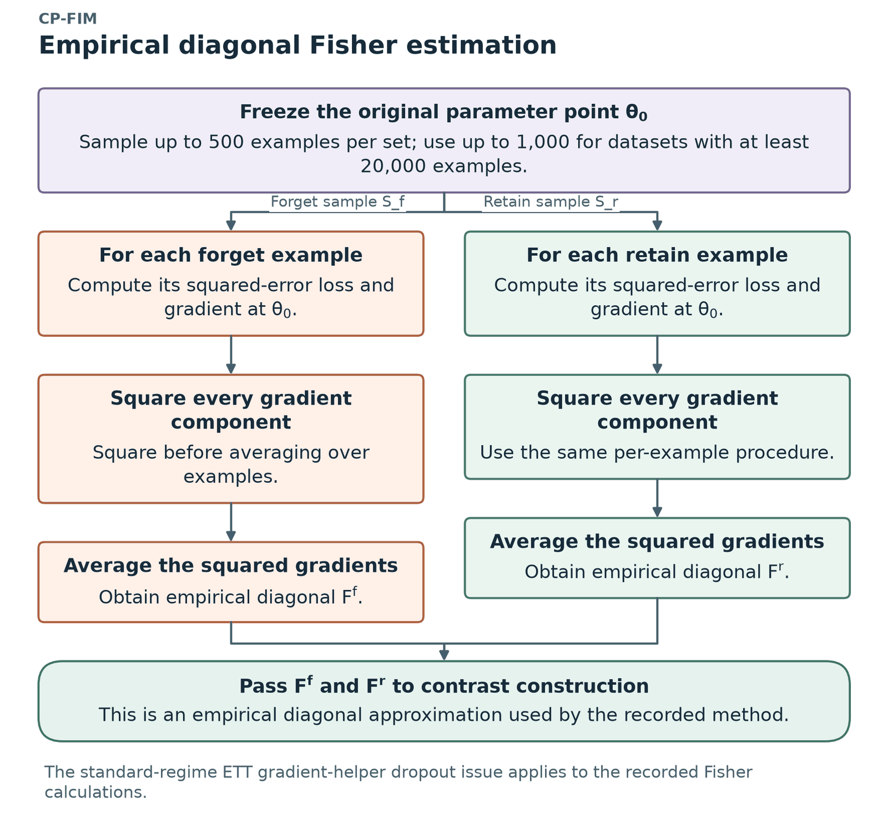</a> | ★★ Empirical diagonal Fisher estimation | Forget and retain Fisher diagonals are estimated by averaging squared per-example gradients evaluated at the original model. | [05](05_cpfim_method.md) |
| <a href="../figures/flowcharts/23_fisher_contrast.png">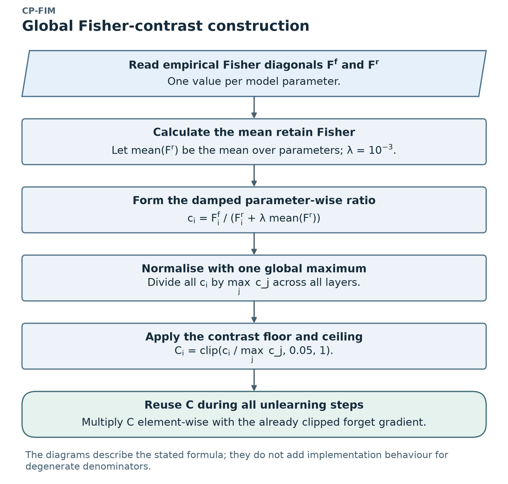</a> | ★★ Global Fisher-contrast construction | A damped forget-to-retain Fisher ratio is globally normalised and clipped to obtain CP-FIM's fixed element-wise preconditioner. | [05](05_cpfim_method.md) |
| <a href="../figures/flowcharts/24_forget_target_calibration.png">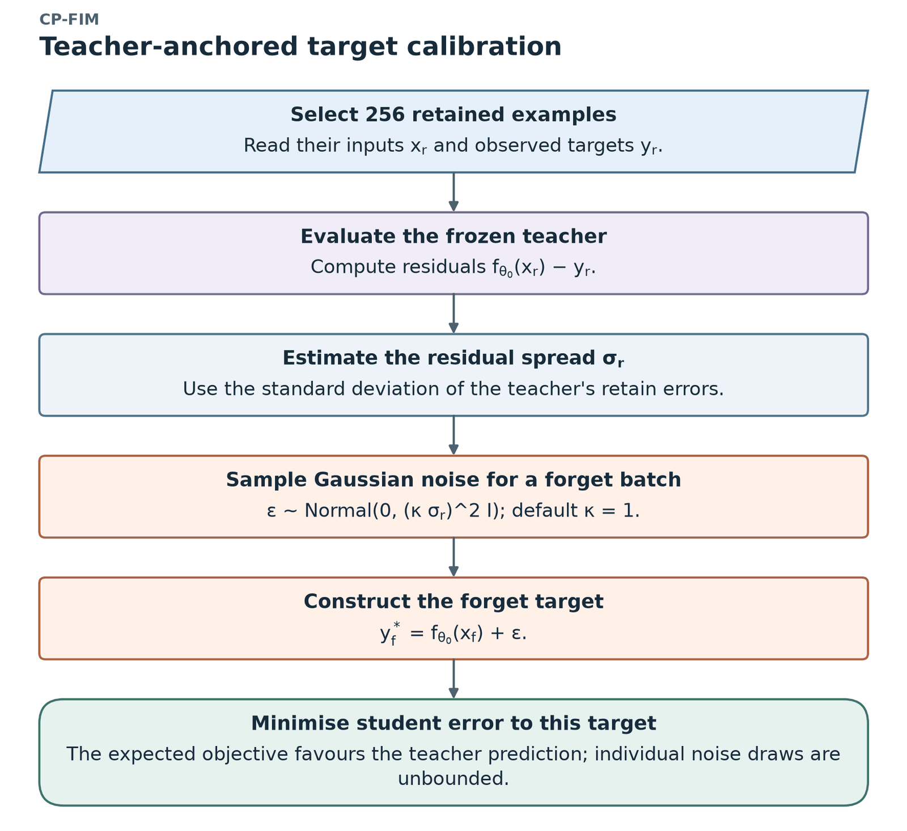</a> | ★★ Teacher-anchored target calibration | CP-FIM calibrates Gaussian noise from retained-data teacher residuals and adds each noise draw to the teacher's forget prediction. | [05](05_cpfim_method.md) |
| <a href="../figures/flowcharts/26_safeguarded_pareto_weight.png">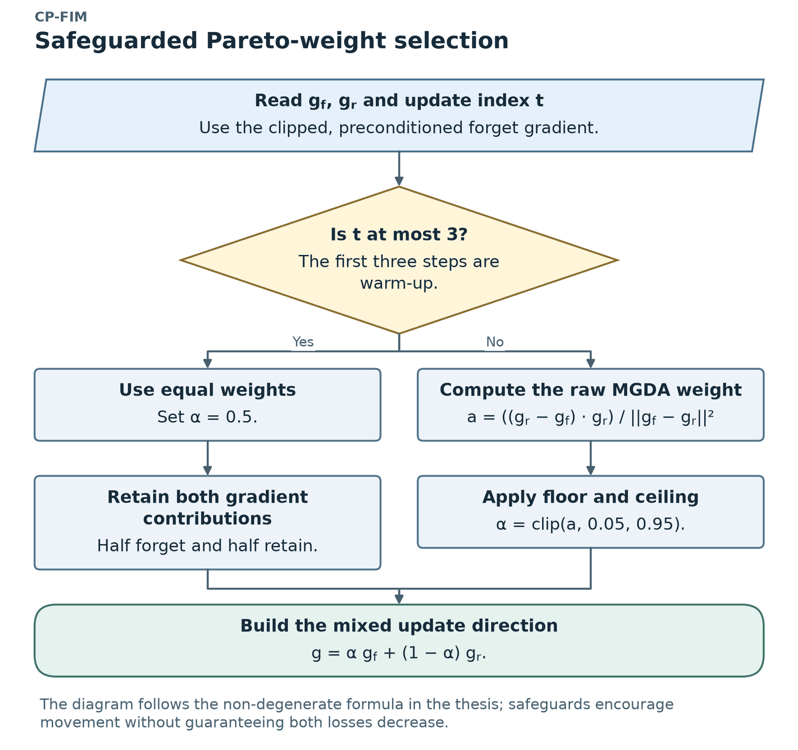</a> | ★★ Safeguarded Pareto-weight selection | CP-FIM fixes the mixing weight during a three-step warm-up, then clips the two-gradient MGDA weight to preserve a contribution from both objectives. | [05](05_cpfim_method.md) |
| <a href="../figures/flowcharts/27_gradient_safeguards.png">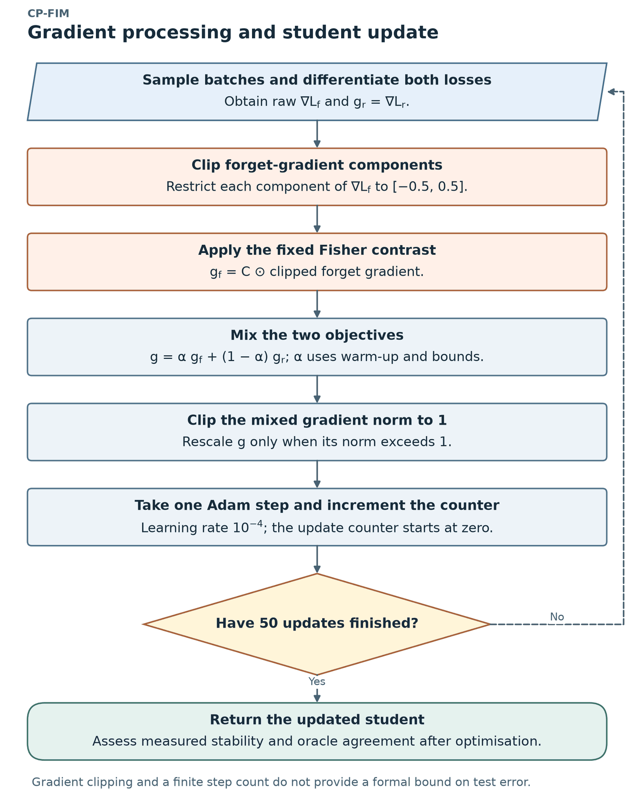</a> | ★★ Gradient processing and student update | The order of CP-FIM's gradient operations: element-wise clipping, fixed contrast scaling, Pareto mixing, norm clipping and an Adam update. | [05](05_cpfim_method.md) |
| <a href="../figures/flowcharts/28_unconstrained_pareto_stall.png">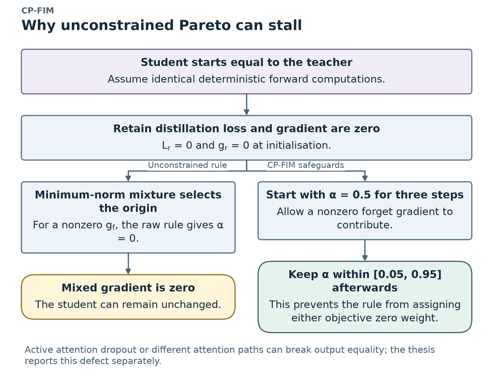</a> | ★ Why unconstrained Pareto can stall | At deterministic teacher-student equality, the retain gradient is zero. The unconstrained minimum-norm rule can therefore choose no update; warm-up and weight bounds address this case. | [09](09_fixes_statistics_robustness.md) |
| <a href="../figures/flowcharts/29_cpfim_vs_direct_noise.png">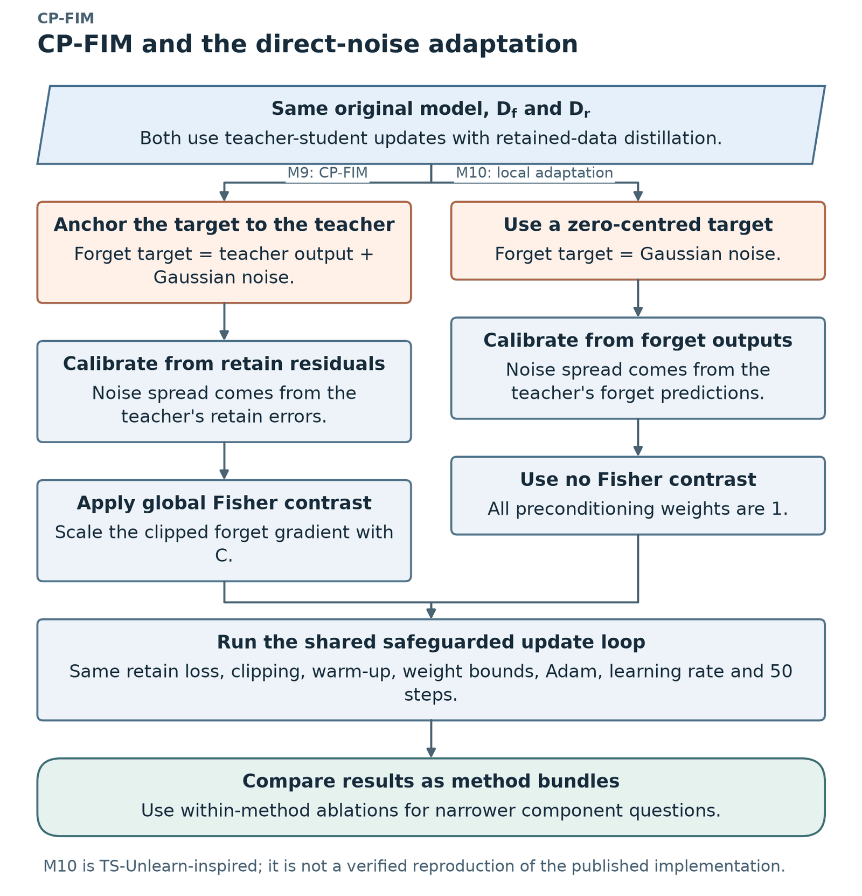</a> | ★★ CP-FIM and the direct-noise adaptation | M9 and M10 share the update framework but differ in target anchoring, noise calibration and Fisher contrast; their comparison changes a bundle of choices. | [05](05_cpfim_method.md) |

### Comparison methods

| Preview | Title | Caption | Used in |
|---|---|---|---|
|  | ★ Anchored ascent and maximum loss | M3 and M11 both increase forget-set loss, with M3 adding a penalty toward the original parameters. Higher forget error is evaluated against retraining rather than treated as successful removal. | [06](06_comparison_methods.md) |
|  | ★ Alternating forget and retain updates | M5 alternates forget ascent and retain descent. M8 uses the same schedule while scaling the forget update by a per-tensor Fisher contrast. | [06](06_comparison_methods.md) |
|  | ★ Fisher noise followed by fine-tuning | M6 perturbs the original parameters with noise shaped by the forget Fisher diagonal, then fine-tunes on retained labels. | [06](06_comparison_methods.md) |
|  | ★ Forget-set relabelling methods | M12 and M13 train on forget inputs with altered targets: noisy original labels or labels sampled from retained examples. | [06](06_comparison_methods.md) |
|  | ★ Retain-only fine-tuning baseline | Retain-only fine-tuning continues supervised training from the original model on retained examples for 50 updates. | [06](06_comparison_methods.md) |

### Evaluation

| Preview | Title | Caption | Used in |
|---|---|---|---|
| <a href="../figures/flowcharts/36_persistence_validity_gate.png">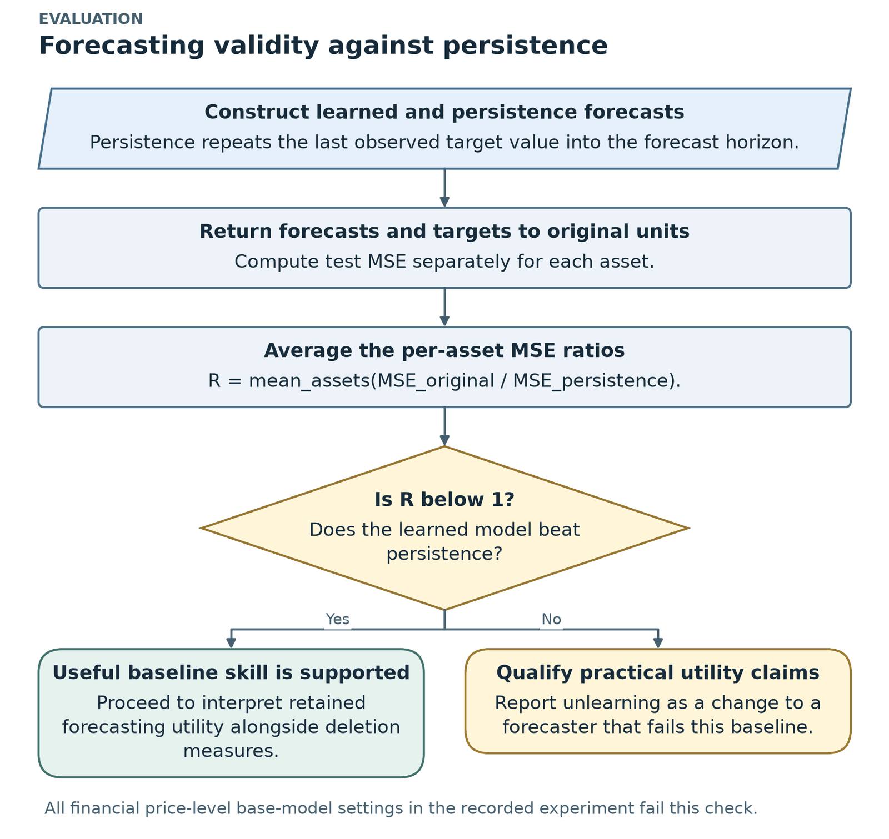</a> | ★★ Forecasting validity against persistence | The forecasting validity gate compares original-model test MSE with last-value persistence in original units and averages the per-asset ratios. | [07](07_evaluation_metrics.md) |
| <a href="../figures/flowcharts/39_loss_based_membership_diagnostic.png">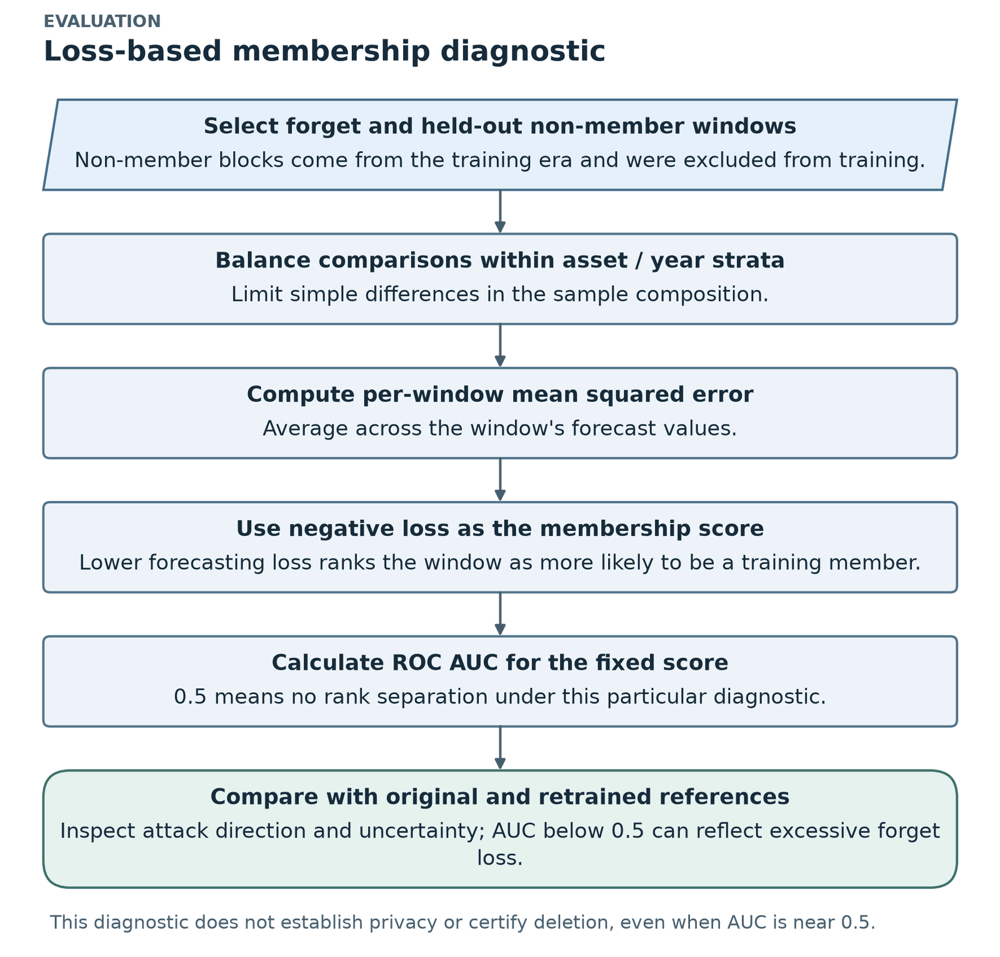</a> | ★★ Loss-based membership diagnostic | The exploratory membership diagnostic ranks forget and held-out non-member windows by negative prediction loss after balancing asset/year strata. | [07](07_evaluation_metrics.md) |
| <a href="../figures/flowcharts/40_utility_stability.png">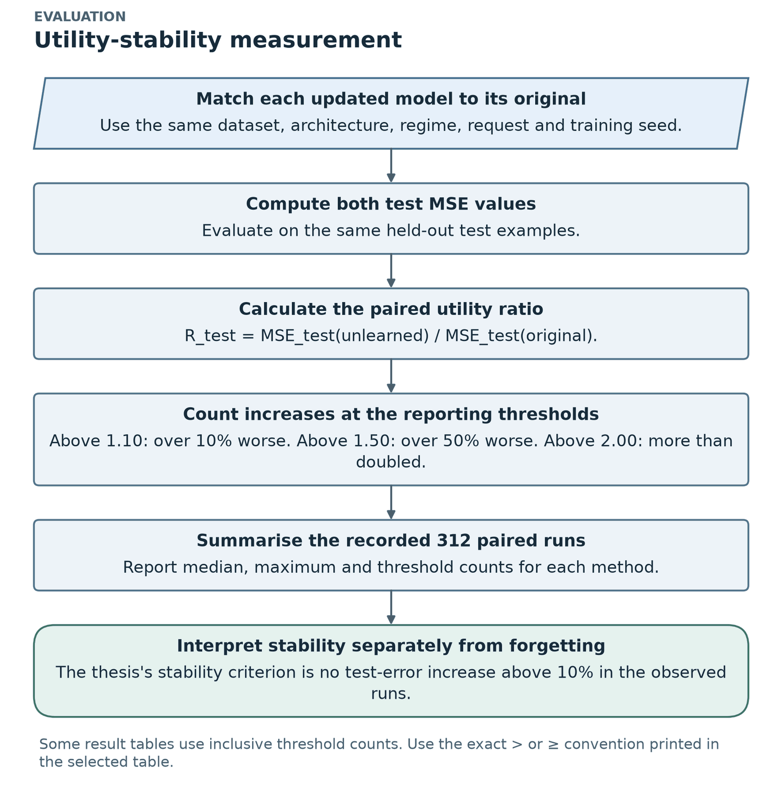</a> | ★ Utility-stability measurement | Paired test-error ratios measure how much each update changes forecasting utility relative to its own original model, with threshold counts and worst-case summaries. | [07](07_evaluation_metrics.md) |
| <a href="../figures/flowcharts/41_paired_statistics.png">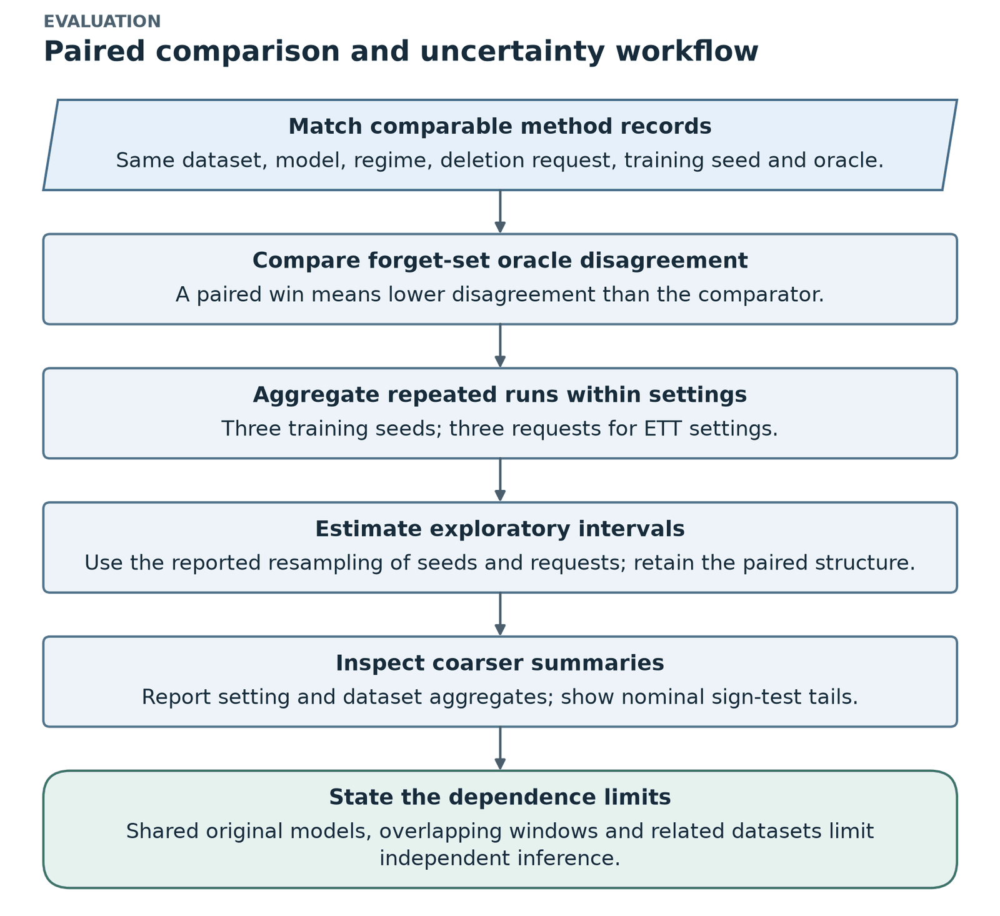</a> | ★★ Paired comparison and uncertainty workflow | Method comparisons preserve the common original model, oracle, seed and deletion request, then summarise variation at run, setting and dataset levels. | [07](07_evaluation_metrics.md) |
|  | ★★ Ablations and update-matched controls | Component ablations and update-matched controls answer different questions: which method choices matter, and how much the update count affects comparisons. | [06](06_comparison_methods.md) |
|  | ★ From experiment grid to result records | The financial and ETT experiment branches produce 104 request-specific configurations, 312 paired runs per method and 9,984 total method records. | [04](04_models_and_training.md) |
| <a href="../figures/flowcharts/46_unique_raw_support.png">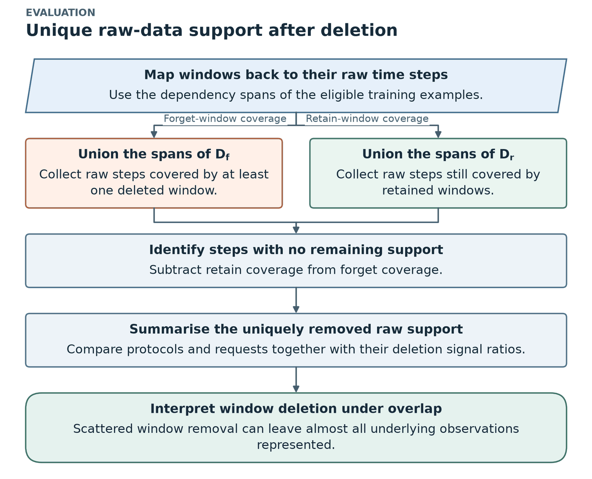</a> | ★ Unique raw-data support after deletion | Unique-support analysis identifies raw observations covered by deleted windows but by no retained window, helping explain the effect of overlapping examples. | [03](03_data_and_deletion.md) |

### Reliability and future work

| Preview | Title | Caption | Used in |
|---|---|---|---|
|  | ★ Reproducible execution and resumption | The documented execution workflow combines preflight checks, run signatures, checkpoint recovery and saved results to support reproducibility. | [04](04_models_and_training.md) |
| <a href="../figures/flowcharts/45_attention_dropout_repair.png">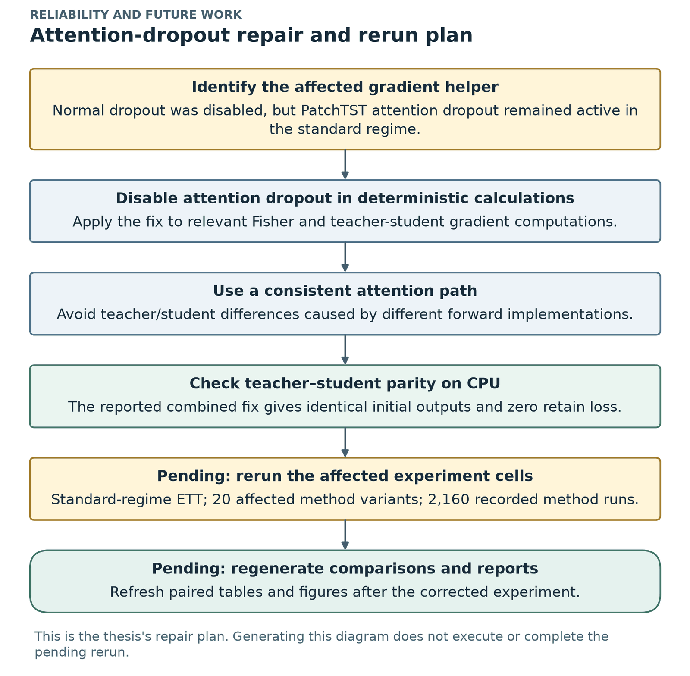</a> | ★ Attention-dropout repair and rerun plan | Repair workflow for the attention-dropout defect. The CPU parity check is reported as completed; the affected full-grid rerun remains pending in the thesis. | [09](09_fixes_statistics_robustness.md) |
| <a href="../figures/flowcharts/47_defect_aware_result_interpretation.png">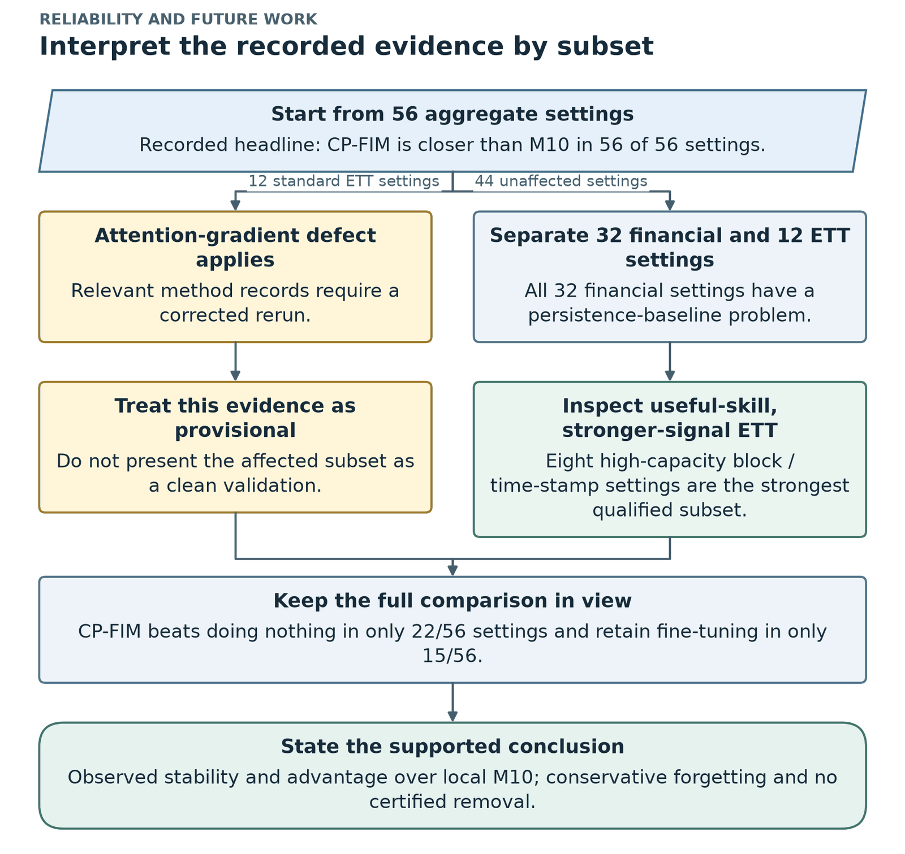</a> | ★★ Interpret the recorded evidence by subset | A subset-aware reading of the M9-versus-M10 comparison separates affected ETT settings from unaffected results, then considers forecasting validity and deletion signal. | [09](09_fixes_statistics_robustness.md) |
|  | ★ Proposed follow-up research workflow | A proposed follow-up workflow derived from the thesis recommendations: repair validity issues, strengthen comparisons, then expand evaluation and practical scope. | [10](10_conclusion_and_impact.md) |

---

## E. Summary charts made for this guide (10)

Built by [`tools/make_summary_charts.py`](../tools/make_summary_charts.py). Every value in that script is copied from a numbered thesis table, named next to the data.

| Preview | Caption | Used in |
|---|---|---|
|  | The thesis in eight numbers. | [README](../README.md) |
| <a href="../figures/summary/01_cpfim_wins_by_method.png">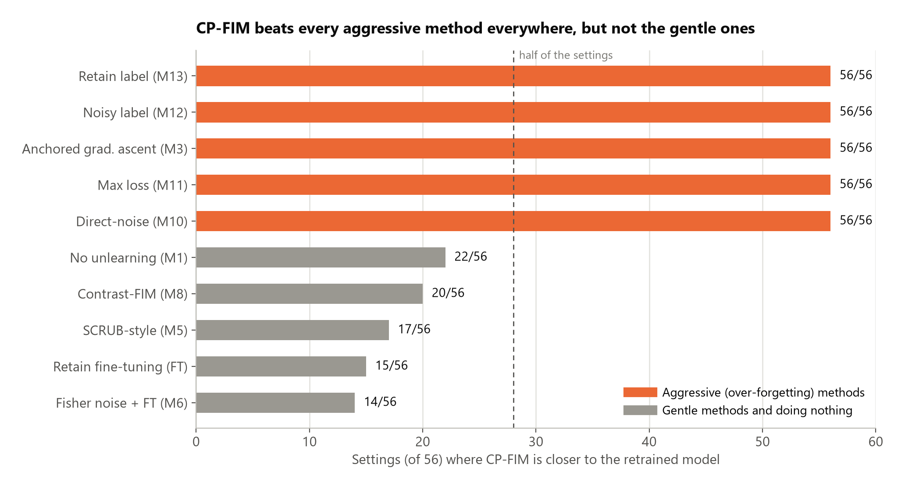</a> | Settings where CP-FIM is closer to retraining than each method (Table 5.9). | [08](08_results.md) |
| <a href="../figures/summary/02_stability_damage_counts.png">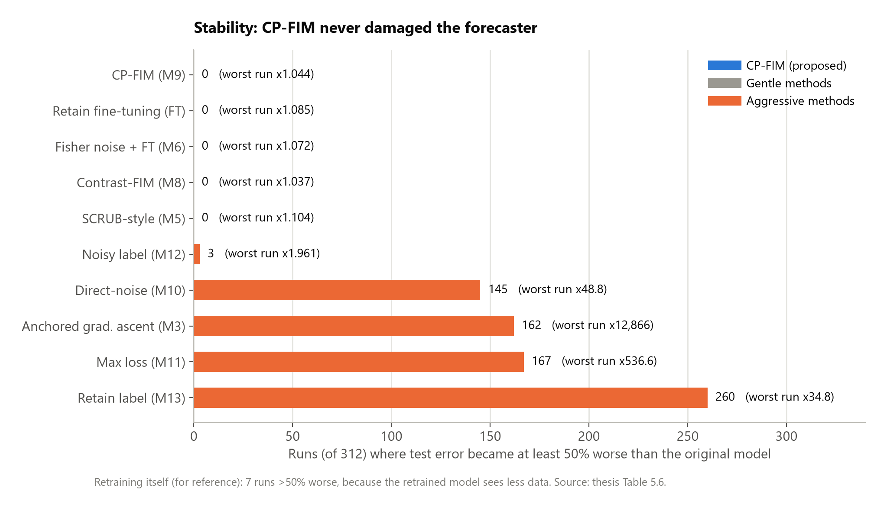</a> | Runs with test error >= 50% worse, per method (Table 5.6). | [08](08_results.md) |
| <a href="../figures/summary/03_mean_rank_closeness.png">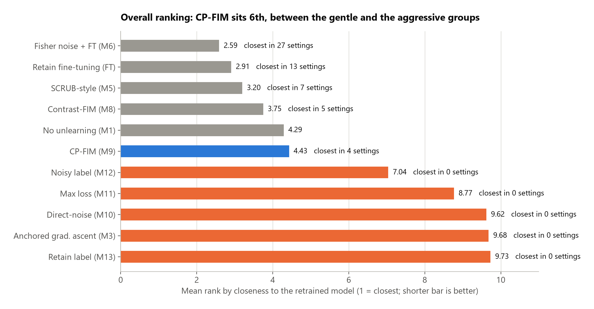</a> | Mean rank by closeness to the oracle (Table 5.10). | [08](08_results.md) |
| <a href="../figures/summary/04_speedup_vs_retraining.png">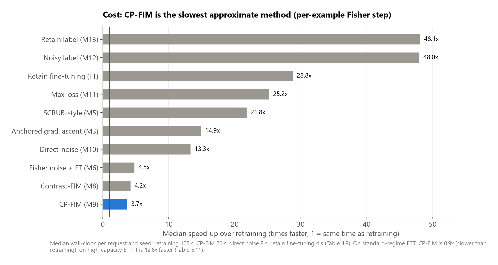</a> | Median speed-up over retraining (Table 5.19). | [08](08_results.md) |
| <a href="../figures/summary/05_rnc_gap_closed.png">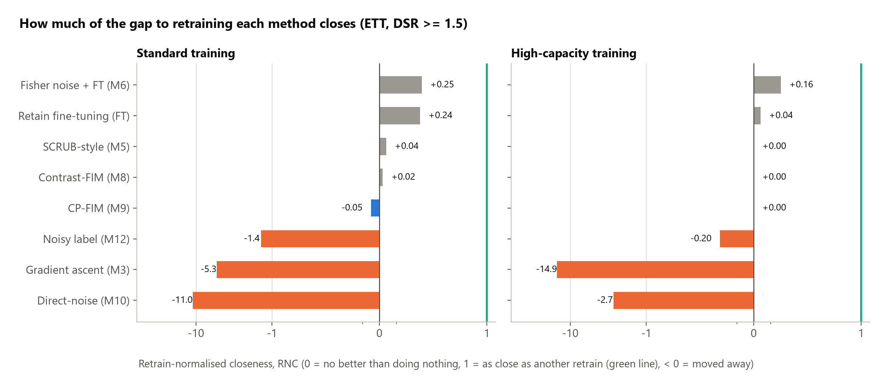</a> | Retrain-normalised closeness by regime (Table 5.11). | [08](08_results.md) |
| <a href="../figures/summary/06_financial_pilot.png">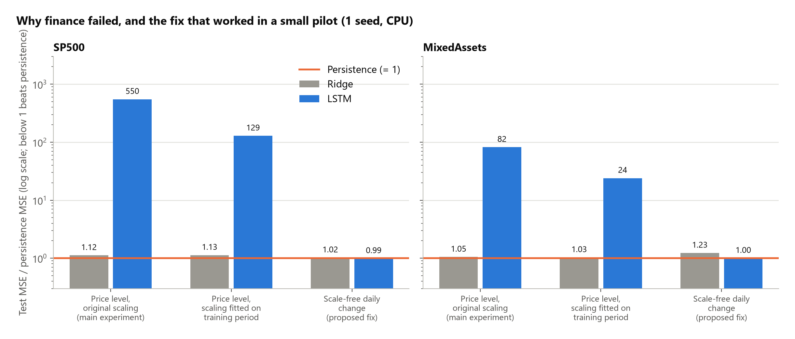</a> | Financial pilot: price level vs daily-change target (Table 5.15). | [09](09_fixes_statistics_robustness.md) |
| <a href="../figures/summary/07_tsunlearn_overforgetting.png">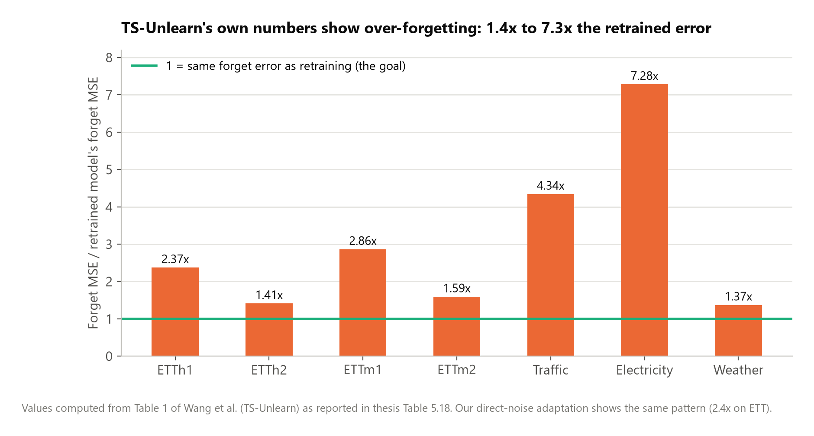</a> | TS-Unlearn's own forget / retrain error ratios (Table 5.18). | [08](08_results.md) |
|  | Where the ~74 GPU-hours went (Chapter 3). | [04](04_models_and_training.md) |
| <a href="../figures/summary/09_membership_auc.png">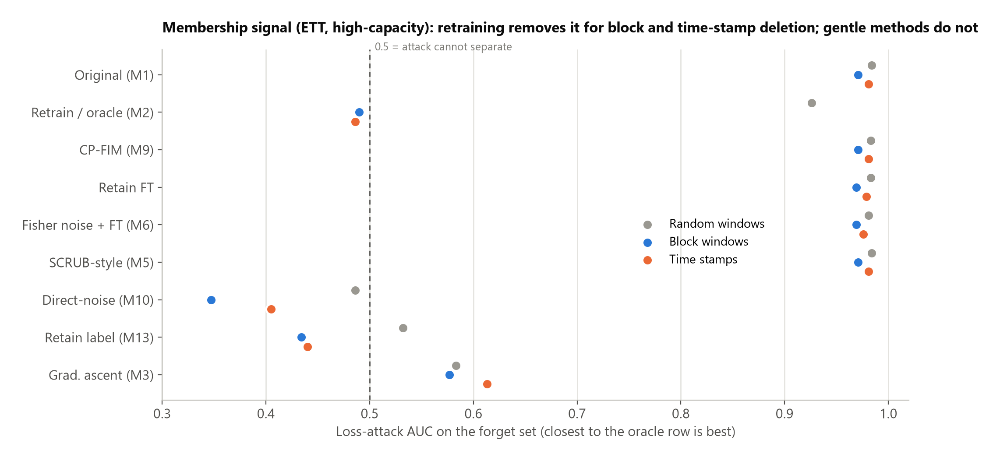</a> | Loss-attack AUC by method and protocol (Table 5.4). | [08](08_results.md) |

---

## F. Diagrams drawn in the chapters (Mermaid)

GitHub renders these directly from text:

| Chapter | Diagram |
|---|---|
| [README](../README.md) | the whole thesis in one flow |
| [01](01_big_picture.md) | overlapping sliding windows; the six research questions |
| [02](02_background_and_literature.md) | literature mind map; the research gap |
| [03](03_data_and_deletion.md) | deletion request routing; crisis-period Gantt chart |
| [04](04_models_and_training.md) | experiment grid (104 → 9,984 → 56 / 312) |
| [05](05_cpfim_method.md) | why CP-FIM is stable and conservative |
| [06](06_comparison_methods.md) | method families (references / push away / anchored) |
| [07](07_evaluation_metrics.md) | DSR and RNC geometry |
| [10](10_conclusion_and_impact.md) | contributions |
